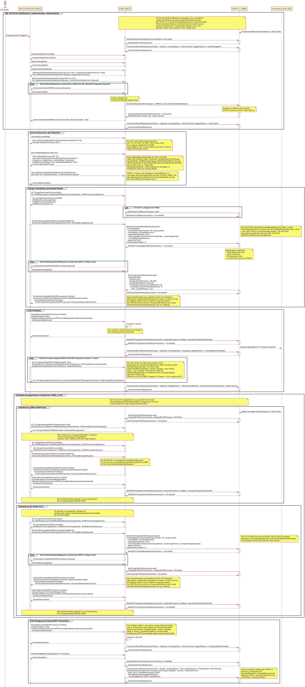

# ISO 15118-20 AC Scheduled Charging + OCPP 2.1 Sequence Diagram

## Key Actors:
- **EV driver:** The person charging the vehicle. Plugs in cable, authenticated via PnC (certificate-based), unplugs cable.
- **ISO 15118-20 EV (EVCC):** Electric Vehicle Communication Controller supporting ISO 15118-20 AC charging with Scheduled control mode.
- **EVSE (SECC):** Supply Equipment Communication Controller interfacing between EV (ISO 15118-20) and CSMS (OCPP 2.1).
- **OCPP 2.1 CSMS:** Charge Station Management System providing authorization, smart charging profiles, and transaction management with ISO 15118-20 awareness.
- **Secondary Actor (SA):** Supplies grid constraints, tariff tables, or aggregated schedule updates (e.g., Energy Management System or grid operator).

---

## 1. Initialization, Authentication, and Authorization (ISO 15118-20 + OCPP 2.1)

### Session Establishment
1. EV driver plugs in cable, triggering communication.
2. EVSE sends `StatusNotificationRequest` (connectorStatus: "Occupied") and `TransactionEventRequest` (eventType = `Started`, chargingState = `EVConnected`, triggerReason = `CablePluggedIn`) to CSMS.

**Insight:** Cable plug-in creates transaction in CSMS before ISO 15118-20 session begins.

### Protocol Negotiation
1. EV and EVSE exchange `SupportedAppProtocolReq/Res` to agree on ISO 15118-20 protocol version.
2. `SessionSetupReq/Res` establishes session with EVSE Session ID.

**Insight:** ISO 15118-20 uses different message names than ISO 15118-2; backward compatibility not guaranteed.

### Plug & Charge (PnC) Certificate-Based Authentication
1. EV sends `AuthorizationSetupReq`, EVSE responds with `AuthorizationSetupRes` (`AuthorizationServices: PnC`, `CertificateInstallationService: false`, `PnC_ASResAuthorizationMode(GenChallenge, SupportedProviders[])`).
2. EV sends `AuthorizationReq` with `SelectedAuthorizationService: PnC` and `PnC_AReqAuthorizationMode` containing:
   - `GenChallenge` (echoed from AuthorizationSetupRes for replay protection)
   - `ContractCertificateChain` (contract certificate + sub-CA chain)
   - The entire `PnC_AReqAuthorizationMode` element is **digitally signed** with the private key associated with the contract certificate
3. EVSE loops `AuthorizationRes` (EVSEProcessing = `Ongoing`) while forwarding to CSMS.
4. EVSE **extracts the eMAID from the contract certificate's X.509 subject field** and sends `AuthorizeRequest` to CSMS with `idToken` (type = `eMAID`) and `iso15118CertificateHashData`.
5. CSMS validates certificate chain via PKI (multi-root path-building, OCSP revocation check: 5-60s latency).
6. CSMS returns `AuthorizeResponse` (idTokenInfo(status = `Accepted`)).
7. EVSE sends final `AuthorizationRes` (EVSEProcessing = `Finished`, ResponseCode = `OK`) to EV.
8. EVSE sends `TransactionEventRequest` (eventType = `Updated`, triggerReason = `Authorized`) to CSMS.

**Insight:** PnC authentication is protocol-level and identical for both AC and DC charging. Unlike ISO 15118-2 where the eMAID was sent as an explicit field in `PaymentDetailsReq`, in ISO 15118-20 the eMAID is embedded within the contract certificate's subject field and extracted by the SECC. The `GenChallenge` provides replay protection. `SupportedProviders` allows the EV to select the correct contract certificate when multiple eMSP contracts are available. OCSP revocation checks add 5-60s latency depending on network conditions.

---

## 2. Service Discovery and Selection

1. EV sends `ServiceDiscoveryReq`, EVSE responds with `ServiceDiscoveryRes` (`ServiceRenegotiationSupported: true`, `EnergyTransferServiceList: [AC]`). A multi-mode EVSE would advertise `[DC, AC, DC_BPT, AC_BPT]`; the diagram models a typical residential AC EVSE.
2. EV sends `ServiceDetailReq` (serviceID: `AC`), EVSE responds with `ServiceDetailRes` (serviceID: `AC`, serviceParameterList: `ParameterSet(ParameterSetID: 1, Connector: SinglePhase, ControlMode: Scheduled, EVSENominalVoltage: 230, MobilityNeedsMode: EVCC, Pricing: AbsolutePricing)`).
3. EV sends `ServiceSelectionReq` (`SelectedEnergyTransferService(ServiceID: AC, ParameterSetID: 1)`, `SelectedVASList`[opt]), EVSE confirms with `ServiceSelectionRes`.

**Insight:** ISO 15118-20 generalizes from "PaymentServiceSelection" (ISO 15118-2) to "ServiceSelection" covering all services. AC is selected for this diagram; alternatives include DC, DC_BPT (bidirectional), AC_BPT, WPT (wireless), ACDP (automated connection).

**ServiceDetailRes parameters per ISO 15118-20 Table 205 [V2G20-1356]** for the unidirectional AC service: `Connector` (1=SinglePhase, 2=ThreePhase, single-phase shown here), `ControlMode` (Scheduled/Dynamic), `EVSENominalVoltage` (intValue 0-500, line-to-neutral voltage in volts), `MobilityNeedsMode` (EVCC-provided / SECC-allowed; SECC-allowed forbidden in Scheduled mode per [V2G20-2663]), `Pricing` (NoPricing/AbsolutePricing/PriceLevels). The AC service has no `BPTChannel`, `GeneratorMode`, or `GridCodeIslandingDetectionMethod` (those are AC_BPT-only, in Table 206).

**ServiceSelectionReq carries both `ServiceID` AND `ParameterSetID`** inside `SelectedEnergyTransferService` (per ISO 15118-20 Table 119 SelectedServiceType): the `ParameterSetID` selects which specific parameter set (from the list offered in `ServiceDetailRes`) the EV is committing to. The OCPP 2.1 Figure 142 shorthand "controlMode=1" on `ServiceSelectionReq` is conveyed in ISO 15118-20 via `ParameterSetID`; the selected ParameterSet from `ServiceDetailRes` carries the `ControlMode` (Scheduled here).

---

## 3. Charge Scheduling (Scheduled Control Mode)

This section follows OCPP 2.1 Figure 142 (K18) and the K18.FR.NN requirements table. The CSMS-bound `NotifyEVChargingNeedsRequest` is triggered by `ScheduleExchangeReq` (per K18.FR.01), NOT by `AC_ChargeParameterDiscoveryReq`; the `EVSEProcessing` Ongoing/Finished loop lives on `ScheduleExchangeRes`, not on `AC_ChargeParameterDiscoveryRes` (whose schema does not carry the field).

### Charge Parameter Discovery
1. EV sends `AC_ChargeParameterDiscoveryReq` carrying `AC_CPDReqEnergyTransferMode(EVMaximumChargePower, EVMinimumChargePower)` (plus optional `_L2`/`_L3` phase variants). `DepartureTime` and `EVTargetEnergyRequest` are NOT carried here; they are sent later in `ScheduleExchangeReq`.
2. EVSE responds `AC_ChargeParameterDiscoveryRes` with `EVSEMaximumChargePower`, `EVSEMinimumChargePower`, `EVSENominalFrequency`. This is a single round-trip; `AC_ChargeParameterDiscoveryRes` does not carry `EVSEProcessing` (per ISO 15118-20 V2G_CI_AC.xsd, only `AuthorizationRes`, `DC_ChargeParameterDiscoveryRes`, `DC_CableCheckRes`, and `ScheduleExchangeRes` carry that field).
3. Optional: CSMS sends `SetDefaultTariffRequest` with tariff for the EVSE (native OCPP 2.1 tariff management).

**Insight:** AC CPD exchanges static EV/EVSE energy boundaries (power limits, nominal frequency) only. It does NOT trigger any CSMS notification; per K18.FR.01 the `NotifyEVChargingNeedsRequest` to CSMS is triggered by `ScheduleExchangeReq` (see next subsection). OCPP 2.1 introduces native tariff management via `SetDefaultTariffRequest` (replacing vendor-specific `DataTransferRequest` used in OCPP 2.0.1).

### Schedule Exchange and EV Charging Needs (per OCPP 2.1 K18 / Figure 142)
1. EV sends `ScheduleExchangeReq` with `MaximumSupportingPoints` and `Scheduled_SEReqControlMode(DepartureTime, EVTargetEnergyRequest)`. **Per K18.FR.01, this is the trigger** for the SECC to forward charging needs to CSMS.
2. EVSE forwards to CSMS via `NotifyEVChargingNeedsRequest` with: `evseId`, `chargingNeeds` (requestedEnergyTransfer: `AC_single_phase`, **controlMode: `ScheduledControl`**, **mobilityNeedsMode: `EVCC`**, **v2xChargingParameters**: `minChargePower`, `maxChargePower`, `evTargetEnergyRequest`, departureTime), `maxScheduleTuples: 3`. Per K18.FR.06, `V2XChargingParametersType` MUST be used (not `ACChargingParametersType`, which is the ISO 15118-2 current/voltage shape).
3. CSMS acknowledges with `NotifyEVChargingNeedsResponse` (status = `Accepted`).
4. CSMS runs its optimization algorithm considering tariff tables from SA, grid constraints, EV departure time, and current load across all EVSEs.
5. While CSMS computes the schedule, EVSE returns `ScheduleExchangeRes(EVSEProcessing=Ongoing)` and EV polls with new `ScheduleExchangeReq` calls. **Per Figure 142, the loop terminates when the EVSE receives `SetChargingProfileRequest` from CSMS** (K18.FR.08 says CSMS SHOULD send it within 60 s to satisfy the ISO 15118-20 ScheduleExchange timeout).
6. CSMS sends `SetChargingProfileRequest` with `chargingProfile` (`transactionId` per K18.FR.07, purpose: `TxProfile`, kind: `Absolute`, `chargingSchedule(chargingRateUnit: W, chargingSchedulePeriod(startPeriod: 0, limit, numberPhases: 1))`). Per the OCPP 2.1 schema, `numberPhases` lives on `ChargingSchedulePeriod`, not on `ChargingSchedule`.
7. EVSE responds `SetChargingProfileResponse` (status = `Accepted`).
8. EVSE sends final `ScheduleExchangeRes` (EVSEProcessing = `Finished`, `Scheduled_SEResControlMode(ScheduleTuple)))`) per K18.FR.20. Per the ISO 15118-20 schema, `PriceLevelSchedule` is nested inside `ScheduleTuple/ChargingSchedule`, not a sibling of `ScheduleTuple`.

**Insight:** `ScheduleExchangeReq/Res` is MANDATORY in Scheduled mode and is the K18.FR.01 trigger for CSMS notification. The response uses `Scheduled_SEResControlMode` (not `Dynamic_SEResControlMode`). Scheduled mode requires CSMS to provide a full schedule before EV can proceed; this distinguishes it from Dynamic mode where CSMS sends single setpoints in real-time. `controlMode: ScheduledControl` tells CSMS the EV expects a full charging schedule. `mobilityNeedsMode: EVCC` means EV controls its schedule (CSMS cannot update departure time). For ISO 15118-20 power-based AC, the OCPP 2.1 schema's `v2xChargingParameters` (V2XChargingParametersType) is the correct mapping; its `minChargePower`/`maxChargePower` field descriptions explicitly reference ISO 15118-20 `EVMinimumChargePower`/`EVMaximumChargePower`. The `acChargingParameters` field (ACChargingParametersType) is reserved for the ISO 15118-2 current/voltage shape (`energyAmount`, `evMinCurrent`, `evMaxCurrent`, `evMaxVoltage`) and would lose the power semantics. For AC, `chargingRateUnit: W` specifies power limits, and `chargingSchedulePeriod.numberPhases: 1` indicates single-phase charging (US 240V split-phase).

---

## 4. Loop Charging

### Power Delivery Start
1. EV sends `PowerDeliveryReq` (`EVProcessing: Finished`, `ChargeProgress: Start`, `EVPowerProfile(Scheduled_EVPPTControlMode(SelectedScheduleTupleID), EVPowerProfileEntries)`). `EVProcessing` is mandatory in the ISO 15118-20 `PowerDeliveryReqType` schema. `SelectedScheduleTupleID` lives inside `EVPowerProfile.Scheduled_EVPPTControlMode` (it is the EV's selection from the offered `ScheduleTuple[]`); the OCPP 2.1 figure shows it as a sibling for shorthand. K18.FR.10 requires the SECC to set `selectedChargingScheduleId` on the subsequent `NotifyEVChargingScheduleRequest` to this value.
2. EVSE closes AC contactor (no pre-charge required - AC voltage is grid-synchronized).
3. EVSE responds `PowerDeliveryRes`.
4. EVSE sends `NotifyEVChargingScheduleRequest` to CSMS with: `evseId`, `chargingSchedule`, `timeBase`, `selectedChargingScheduleId`.
5. CSMS acknowledges `NotifyEVChargingScheduleResponse` (status = `Accepted`).
6. CSMS may forward aggregated schedule to Secondary Actor for grid management.
7. EVSE sends `TransactionEventRequest` (eventType = `Updated`, chargingState = `Charging`, triggerReason = `ChargingStateChanged`).

**Insight:** `NotifyEVChargingScheduleRequest` reports EV's calculated schedule back to CSMS, enabling aggregated load forecasting. Unlike DC, AC charging requires no pre-charge phase because AC voltage is synchronized with the grid.

### AC Charge Loop (OEM-Dependent Frequency)
1. Loop periodically during charging (**250ms (V2G_SECC_Sequence_Timeout = 0.5s, same as DC)**):
   - EV sends `AC_ChargeLoopReq` with: `MeterInfoRequested` (boolean, mandatory), `Scheduled_AC_CLReqControlMode(EVPresentActivePower)` (only mandatory field; `EVPresentReactivePower` shown for context but optional), optional `displayParameters` (SoC).
   - EVSE responds `AC_ChargeLoopRes` with: `Scheduled_AC_CLResControlMode(EVSETargetActivePower, EVSETargetReactivePower)` (both fields are optional in the response per the schema).
2. Periodically, EVSE sends `TransactionEventRequest(eventType = Updated, triggerReason = MeterValuePeriodic)` to CSMS with the periodic meterValue[] payload (per OCPP 2.1 Part 2 J. Meter Values, transaction-related meter values are never sent in standalone MeterValuesRequest).

**Insight:** Per ISO 15118-20 Table 162 [V2G20-1757], `Scheduled_AC_CLReqControlMode` has ONE mandatory field: `EVPresentActivePower`. All other fields (`EVPresentReactivePower`, energy requests, max charge limits, three-phase `_L2`/`_L3` variants) are optional. `MeterInfoRequested` is mandatory at the `AC_ChargeLoopReq` top level (per Table 156): set to `true` to request the EVSE to include `MeterInfo` in the corresponding `AC_ChargeLoopRes`. AC charge loop runs at 250ms (V2G_SECC_Sequence_Timeout = 0.5s), the same cadence as DC. AC uses power-based parameters (active power required, reactive power optional) rather than DC's current/voltage control.

---

## 5. Schedule Renegotiation

ISO 15118-20 renegotiation is architecturally different from ISO 15118-2. In -2, renegotiation halted the charge loop: the EV sent `PowerDeliveryReq(Renegotiate)` and re-entered `ChargeParameterDiscoveryReq/Res`. In -20, renegotiation uses a **parallel side stream** (V2GTP `ScheduleRenegotiationPayloadID`) while the main charge loop (`AC_ChargeLoopReq/Res`) continues uninterrupted [V2G20-1045].

The K16 and K17 side-stream sequences differ in one critical respect: per **K16.FR.09**, the SECC SHALL NOT send `NotifyEVChargingNeedsRequest` for CSMS-initiated renegotiation (CSMS already knows the EV's needs and has just supplied a new profile). For EV-initiated renegotiation (K17), `NotifyEVChargingNeedsRequest` IS sent, but its trigger is `ScheduleExchangeReq` (per Figure 141), NOT `ChargeParameterDiscoveryReq`. The two flows are therefore documented separately below.

### Initiated by CSMS (OCPP Use Case K16, Figure 139)
1. Secondary Actor updates available PmaxSchedule or tariff table to CSMS.
2. CSMS sends `SetChargingProfileRequest` (chargingProfile carries `transactionId` and `chargingProfilePurpose: TxProfile`) to EVSE.
3. EVSE responds `SetChargingProfileResponse` (status = `Accepted`). This profile arrival is the K16 trigger.
4. On the next main-stream `AC_ChargeLoopReq`, EVSE responds with `AC_ChargeLoopRes(EVSENotification=ScheduleRenegotiation)`. Main-stream loop continues uninterrupted.
5. EV opens the side stream (`ScheduleRenegotiationPayloadID`) and sends `AC_ChargeParameterDiscoveryReq`.
6. EVSE responds `AC_ChargeParameterDiscoveryRes` with EVSE power limits and `EVSENominalFrequency`. Single round-trip; no `EVSEProcessing` field.
7. EV sends `ScheduleExchangeReq` (`MaximumSupportingPoints`, `Scheduled_SEReqControlMode(DepartureTime, EVTargetEnergyRequest)`).
8. **Per K16.FR.09, the EVSE does NOT send `NotifyEVChargingNeedsRequest`.** Instead, the EVSE responds directly with `ScheduleExchangeRes` (EVSEProcessing = `Finished`, `Scheduled_SEResControlMode(...)`) carrying the `ChargingSchedule(s)` already supplied by CSMS in step 2.
9. EV sends `PowerDeliveryReq` (`EVProcessing: Finished`, `ChargeProgress = ScheduleRenegotiation`, `EVPowerProfile(Scheduled_EVPPTControlMode(SelectedScheduleTupleID), EVPowerProfileEntries)`) on the side stream.
10. EVSE responds `PowerDeliveryRes`.
11. EVSE sends `NotifyEVChargingScheduleRequest(evseId, chargingSchedule, timeBase, selectedChargingScheduleId)` to CSMS, then receives `NotifyEVChargingScheduleResponse` (status = `Accepted`). Per K16.FR.14, the SECC SHOULD set `selectedChargingScheduleId` to the schedule ID the EV selected.
12. New `EVPowerProfile` is applied in the next mainstream `AC_ChargeLoopReq` [V2G20-1050].

**Insight:** The main stream `AC_ChargeLoopReq/Res` continues uninterrupted during renegotiation. The `EVSENotification=ScheduleRenegotiation` flag is the signal for the EV to initiate the side stream. Due to AC's 250ms polling cadence, the EV may take up to 500ms to observe the notification (worst case). The K16.FR.09 prohibition on `NotifyEVChargingNeedsRequest` reflects that CSMS already has the EV's prior charging needs and has just acted on them by sending the new profile.

### Initiated by EV (OCPP Use Case K17, Figure 141)
1. EV opens a parallel side stream (`ScheduleRenegotiationPayloadID`) per [V2G20-1846] when its charging needs change (e.g., updated departure time, different energy request).
2. EV sends `AC_ChargeParameterDiscoveryReq` carrying `AC_CPDReqEnergyTransferMode(EVMaximumChargePower, EVMinimumChargePower)` on the side stream.
3. EVSE responds `AC_ChargeParameterDiscoveryRes` with EVSE power limits and `EVSENominalFrequency`. Single round-trip; no `EVSEProcessing` field.
4. EV sends `ScheduleExchangeReq` (`MaximumSupportingPoints`, `Scheduled_SEReqControlMode(DepartureTime, EVTargetEnergyRequest)`). **Per K17.FR.01 and Figure 141, this is the trigger for `NotifyEVChargingNeedsRequest`** (NOT `AC_ChargeParameterDiscoveryReq`).
5. EVSE forwards to CSMS via `NotifyEVChargingNeedsRequest(evseId, chargingNeeds(requestedEnergyTransfer: AC_single_phase, controlMode: ScheduledControl, mobilityNeedsMode: EVCC, v2xChargingParameters(minChargePower, maxChargePower, evTargetEnergyRequest), departureTime), maxScheduleTuples: 3)`. Per K17.FR.06 (mirroring K18.FR.06), `V2XChargingParametersType` MUST be used for ISO 15118-20; the full payload mirrors the K18 main flow above.
6. CSMS acknowledges with `NotifyEVChargingNeedsResponse` (status = `Accepted`).
7. While CSMS computes the new schedule, EVSE returns `ScheduleExchangeRes(EVSEProcessing=Ongoing)` and EV polls with new `ScheduleExchangeReq` calls. **Per Figure 141, the loop terminates when the EVSE receives `SetChargingProfileRequest` from CSMS** (per K17.FR.07).
8. CSMS sends `SetChargingProfileRequest` (`transactionId`, `chargingProfilePurpose: TxProfile`); EVSE responds `SetChargingProfileResponse` (status = `Accepted`).
9. EVSE sends final `ScheduleExchangeRes` (EVSEProcessing = `Finished`, `Scheduled_SEResControlMode(ScheduleTuple)))`).
10. EV sends `PowerDeliveryReq` (`EVProcessing: Finished`, `ChargeProgress = ScheduleRenegotiation`, `EVPowerProfile(Scheduled_EVPPTControlMode(SelectedScheduleTupleID), EVPowerProfileEntries)`) on the side stream.
11. EVSE responds `PowerDeliveryRes`.
12. EVSE sends `NotifyEVChargingScheduleRequest(evseId, chargingSchedule, timeBase, selectedChargingScheduleId)` to CSMS per K17.FR.10; receives `NotifyEVChargingScheduleResponse` (status = `Accepted`). Per K17.FR.18, the SECC SHOULD set `selectedChargingScheduleId` to the schedule ID the EV selected.
13. New `EVPowerProfile` is applied in the next mainstream `AC_ChargeLoopReq` [V2G20-1050].

**Insight:** K17 mirrors the K18 main-flow trigger rule: `NotifyEVChargingNeedsRequest` follows `ScheduleExchangeReq`, and the SE loop terminates upon `SetChargingProfileRequest` arrival. The `ChargeProgress=ScheduleRenegotiation` value in `PowerDeliveryReq` is unique to ISO 15118-20 (not present in -2). The entire renegotiation sequence occurs on the side stream while charge loop messages continue on the main stream.

---

## 6. End Charging and Stop OCPP Transaction

### Stop Charging
1. EV sends `PowerDeliveryReq` (`EVProcessing: Finished`, `ChargeProgress: Stop`, `EVPowerProfile(Scheduled_EVPPTControlMode(SelectedScheduleTupleID), EVPowerProfileEntries)`). Per [V2G20-1546]: in all control modes `EVPowerProfile`, and in Scheduled Control Mode also `ScheduleTupleID`, shall be sent when `ChargeProgress` is `Start`, `Standby`, `Stop`, or `Pause`. The `ScheduleTupleID` is carried inside `EVPowerProfile.Scheduled_EVPPTControlMode.SelectedScheduleTupleID`.
2. EVSE opens AC contactors.
3. EVSE responds `PowerDeliveryRes`.
4. EVSE sends `TransactionEventRequest` (eventType = `Updated`, chargingState = `EVConnected`, triggerReason = `ChargingStateChanged`).

### No Welding Detection for AC

**Note:** AC charging does **not** perform welding detection. This is a DC-only safety check required by IEC 61851-23 to detect welded contactors in high-voltage DC circuits. AC charging proceeds directly to session stop.

**Insight:** The absence of `DC_WeldingDetectionReq/Res` is a key difference between AC and DC session termination flows.

### Session Stop
1. EV sends `SessionStopReq(ChargingSession: Terminate)`.
2. EVSE responds `SessionStopRes`.
3. EVSE sends `StatusNotificationRequest` (connectorStatus: `Available`).
4. EVSE sends final `TransactionEventRequest` (eventType = `Ended`, chargingState = `Idle`, triggerReason = `EVDeparted`, `meterValue[]`) carrying the final cumulative `Energy.Active.Import.Register` (30.0 kWh) with `context: Transaction.End` and `signedMeterValue` (OCMF).
5. CSMS acknowledges both requests.

**Insight:** Transaction ends after clean session stop. `triggerReason = EVDeparted` is used for normal termination (vs `EVCommunicationLost` for abnormal). The final `meterValue[]` carries the cumulative session totals used for billing; which measurands appear is governed by `SampledDataCtrlr.TxEndedMeasurands` (OCPP 2.1 Section J). This is the OCPP 2.1 equivalent of the OCPP 1.6J `StopTransaction.req.meterStop` plus optional `transactionData[]`; OCPP 2.1 forbids transaction-related readings in standalone `MeterValuesRequest`.

---

## Key Differences: ISO 15118-20 vs ISO 15118-2 (AC Charging)

| Aspect | ISO 15118-2 | ISO 15118-20 (This Diagram) |
|--------|-------------|------------------------------|
| Charge loop message | `ChargingStatusReq/Res` | `AC_ChargeLoopReq/Res` |
| Service selection | `PaymentServiceSelectionReq/Res` | `ServiceSelectionReq/Res` |
| Schedule exchange | Not present | `ScheduleExchangeReq/Res` (Scheduled mode) |
| Control modes | Single implicit mode | Explicit Scheduled vs Dynamic modes |
| Parameter discovery | `ChargeParameterDiscoveryReq` (generic) | `AC_ChargeParameterDiscoveryReq` (AC-specific) |
| PnC authentication | `PaymentServiceSelectionReq` + `PaymentDetailsReq(EMAID, CertChain)` + `AuthorizationReq` (3 pairs) | `AuthorizationSetupReq(GenChallenge)` + `AuthorizationReq(PnC_AReqAuthorizationMode [signed])` (2 pairs) |
| eMAID handling | Explicit field in `PaymentDetailsReq` | Extracted from contract certificate X.509 subject by SECC |
| Renegotiation | Halts charge loop; `PowerDeliveryReq(Renegotiate)` then re-enters `ChargeParameterDiscoveryReq/Res` | Parallel side stream (ScheduleRenegotiationPayloadID); charge loop continues uninterrupted [V2G20-1045] |

## Key Differences: OCPP 2.0.1 vs OCPP 2.1

| Aspect | OCPP 2.0.1 | OCPP 2.1 (This Diagram) |
|--------|------------|--------------------------|
| Control mode field | Not present | `controlMode: ScheduledControl` in `NotifyEVChargingNeedsRequest` |
| Mobility needs mode | Not present | `mobilityNeedsMode: EVCC` in `NotifyEVChargingNeedsRequest` |
| EV schedule reporting | Not present | `NotifyEVChargingScheduleRequest` (Scheduled mode only) |
| Operation mode (BPT) | Not present | `operationMode` in `SetChargingProfileRequest` (for charge/discharge) |
| Tariff management | Vendor-specific via `DataTransferRequest` | Native `SetDefaultTariffRequest`, `GetTariffsRequest`, `ClearTariffsRequest`, `ChangeTransactionTariffRequest`, `CostUpdatedRequest` |

## Key Differences: AC vs DC Charging (ISO 15118-20)

| Aspect | DC Charging | AC Charging (This Diagram) |
|--------|-------------|----------------------------|
| Charge loop message | `DC_ChargeLoopReq/Res` | `AC_ChargeLoopReq/Res` |
| Loop frequency | Every 250ms (V2G_SECC_Sequence_Timeout = 0.5s) | Every 250ms (V2G_SECC_Sequence_Timeout = 0.5s, same as DC per spec) |
| Parameter discovery | `DC_ChargeParameterDiscoveryReq/Res` | `AC_ChargeParameterDiscoveryReq/Res` |
| OCPP charging parameters | `dcChargingParameters` (power, current, voltage) | `v2xChargingParameters` (min/max charge power, evTargetEnergyRequest); `acChargingParameters` is the ISO 15118-2 current/voltage shape and is not used for ISO 15118-20 power-based AC |
| Energy transfer type | `requestedEnergyTransfer: DC` | `requestedEnergyTransfer: AC_single_phase` |
| Charging profile unit | `chargingRateUnit: W` (power-based) | `chargingRateUnit: W` (power-based) |
| Safety phases | CableCheck, PreCharge, WeldingDetection | None (AC contactor closes without pre-charge; no welding detection) |
| EV parameters in charge loop | `EVTargetCurrent`, `EVTargetVoltage` | `Scheduled_AC_CLReqControlMode(EVPresentActivePower)` |
| EVSE parameters in charge loop | `EVSEPresentCurrent`, `EVSEPresentVoltage`, power/current/voltage limit flags | `Scheduled_AC_CLResControlMode(EVSETargetActivePower)` |
| Contactor closure | After PreCharge (voltage matching) | Direct (AC voltage grid-synchronized) |
| Renegotiation latency | 250ms until next loop iteration | up to 500ms until next loop iteration |
| Extra ISO 15118-20 round-trips vs AC | `DC_CableCheckReq/Res`, `DC_PreChargeReq/Res`, `DC_WeldingDetectionReq/Res` | None (the three DC safety round-trips are omitted) |

---

## References
- [ISO 15118-20:2022 - Vehicle to Grid Communication Interface](https://www.iso.org/standard/77845.html)
- [OCPP 2.1 Edition 1 (2025-01-23)](https://openchargealliance.org/protocols/open-charge-point-protocol/)
- PlantUML source: `iso15118_20_ac-ocpp21_scheduled.puml`
- Related diagrams:
  - `../iso15118_2_ac-ocpp2/` (ISO 15118-2 + OCPP 2.0.1 predecessor)
  - `../iso15118_20_dc-ocpp21_scheduled/` (DC Scheduled reference diagram)
  - `../iso15118_20_ac-ocpp21_dynamic/` (Dynamic control mode variant)
  - `../iso15118_20_ac_bpt-ocpp21_dynamic/` (AC Bidirectional power transfer)
