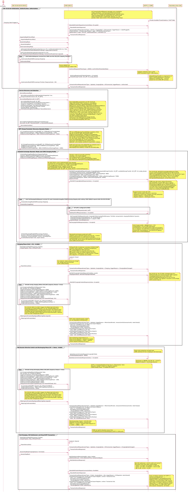

# ISO 15118-20 AC BPT + OCPP 2.1 (Dynamic Control Mode) Sequence Diagram

## Key Actors:
- **EV driver:** The person plugging in the cable and initiating the V2H session. In residential V2H scenarios, the driver typically configures departure time and minimum SoC reserves before plugging in; CSMS controls charge/discharge automatically thereafter.
- **ISO 15118-20 EV (EVCC):** Electric Vehicle Communication Controller supporting AC Bidirectional Power Transfer (`AC_BPT`) with Dynamic control mode. Declares both charge and discharge power limits, executes charge and discharge loops with signed power values (watts), and yields scheduling authority to the CSMS while communicating constraints (departure time, target energy, V2X energy bounds).
- **EVSE (SECC):** Supply Equipment Communication Controller interfacing between EV (ISO 15118-20) and CSMS (OCPP 2.1). Advertises `AC_BPT` capability, enforces safety limits, and applies CSMS setpoints to the EV's on-board inverter via the AC contactor. Operates the contactor bidirectionally for both import and export power flow.
- **OCPP 2.1 CSMS:** Charge Station Management System providing authorization, real-time bidirectional setpoint control, V2H settlement, and transaction management. Calculates optimal charge/discharge setpoints based on home solar production, load, time-of-use tariffs, and user preferences.
- **Secondary Actor (SA):** Supplies tariff tables, electricity prices, solar production data, or home load updates. Could be a Home Energy Management System (HEMS), smart meter API, or utility tariff feed.

---

## 1. Initialization, Authentication, and Authorization (ISO 15118-20 + OCPP 2.1)

### Session Establishment
1. EV driver plugs in cable, triggering communication.
2. EVSE sends `StatusNotificationRequest` (connectorStatus: "Occupied") and `TransactionEventRequest` (eventType = `Started`, chargingState = `EVConnected`, triggerReason = `CablePluggedIn`) to CSMS.

**Insight:** Cable plug-in creates the transaction in CSMS before the ISO 15118-20 session begins.

### Protocol Negotiation
1. EV and EVSE exchange `SupportedAppProtocolReq/Res` to agree on ISO 15118-20 protocol version.
2. `SessionSetupReq/Res` establishes session with EVSE Session ID.

### Plug & Charge (PnC) Certificate-Based Authentication
1. EV sends `AuthorizationSetupReq`, EVSE responds with `AuthorizationSetupRes` (`AuthorizationServices: PnC`, `CertificateInstallationService: false`, `PnC_ASResAuthorizationMode(GenChallenge, SupportedProviders[])`).
2. EV sends `AuthorizationReq` with `SelectedAuthorizationService: PnC` and `PnC_AReqAuthorizationMode` containing:
   - `GenChallenge` (echoed from AuthorizationSetupRes for replay protection)
   - `ContractCertificateChain` (contract certificate + sub-CA chain)
   - The entire `PnC_AReqAuthorizationMode` element is **digitally signed** with the private key associated with the contract certificate
3. EVSE loops `AuthorizationRes` (EVSEProcessing = `Ongoing`) while forwarding to CSMS.
4. EVSE **extracts the eMAID from the contract certificate's X.509 subject field** and sends `AuthorizeRequest` to CSMS with `idToken` (type = `eMAID`) and `iso15118CertificateHashData`.
5. CSMS validates certificate chain via PKI (multi-root path-building, OCSP revocation check: 5-60s latency).
6. CSMS returns `AuthorizeResponse` (idTokenInfo(status = `Accepted`), `allowedEnergyTransfer: [AC_BPT, AC_single_phase]`).
7. EVSE sends final `AuthorizationRes` (EVSEProcessing = `Finished`, ResponseCode = `OK`) to EV.
8. EVSE sends `TransactionEventRequest` (eventType = `Updated`, triggerReason = `Authorized`) to CSMS.

**Insight:** PnC is the primary authentication method in ISO 15118-20. Unlike ISO 15118-2, where the eMAID was sent as an explicit field in `PaymentDetailsReq`, in ISO 15118-20 the eMAID is embedded in the contract certificate's subject field and extracted by the SECC. The `GenChallenge` provides replay protection. `SupportedProviders` lets the EV select the correct contract certificate when multiple eMSP contracts are available.

**BPT-specific:** `allowedEnergyTransfer` is a top-level OCPP 2.1 field on `AuthorizeResponse`. Omitting it defaults to charging only; it must be present and include `AC_BPT` for the EVSE to offer bidirectional services to the EV.

---

## 2. Service Discovery and Selection

1. EV sends `ServiceDiscoveryReq`, EVSE responds with `ServiceDiscoveryRes` (`ServiceRenegotiationSupported: true`, `EnergyTransferServiceList: [AC, AC_BPT]`). An AC EVSE advertises only AC services; DC services are absent because the EVSE has no DC hardware.
2. EV sends `ServiceDetailReq` (`ServiceID: AC_BPT`), EVSE responds with `ServiceDetailRes` (`ServiceID: AC_BPT`, `ServiceParameterList: ParameterSet(ParameterSetID: 1, Connector: SinglePhase, ControlMode: Dynamic, EVSENominalVoltage: 240, MobilityNeedsMode: EVCC, Pricing: AbsolutePricing, BPTChannel: Unified, GeneratorMode: GridFollowing, GridCodeIslandingDetectionMethod: PassiveDetection)`). `EVSENominalVoltage` per Table 206 is the line-to-neutral voltage. For US residential 240V split-phase (L1-L2 wiring with no neutral on the EV side), implementations commonly report `240` here so the EV can derive current directly from `EVMaxPower / 240V`; a strict-spec reading would be `120` (L-N from either leg) with the EV computing 240V line-to-line. `Connector: SinglePhase` aligns with `numberPhases: 1` used in the OCPP charging profile in §4.
3. EV sends `ServiceSelectionReq` (`SelectedEnergyTransferService(ServiceID: AC_BPT, ParameterSetID: 1)`, `SelectedVASList`[opt]), EVSE confirms with `ServiceSelectionRes`.

**Insight:** ISO 15118-20 generalizes from "PaymentServiceSelection" (ISO 15118-2) to "ServiceSelection" to cover all services. Presence of `AC_BPT` in the service list indicates EVSE supports V2H using the EV's on-board inverter.

**ServiceDetailRes parameters per ISO 15118-20 Table 206 [V2G20-1361]** for the AC BPT service:

| Parameter | Values | Purpose |
|-----------|--------|---------|
| `Connector` | 1=SinglePhase, 2=ThreePhase | Connector type |
| `ControlMode` | 1=Scheduled, 2=Dynamic | Who computes the schedule |
| `EVSENominalVoltage` | intValue 0-500 | Line-to-neutral voltage (volts) |
| `MobilityNeedsMode` | 1=EVCC-provided, 2=SECC-allowed | Who provides departure time / energy targets |
| `Pricing` | 0=No pricing, 1=AbsolutePricing, 2=PriceLevels | Pricing structure used in offered schedules |
| `BPTChannel` | 1=Unified, 2=Separated | Power transfer channel topology |
| `GeneratorMode` | 1=GridFollowing, 2=GridForming | Power converter behaviour |
| `GridCodeIslandingDetectionMethod` | 1=ActiveDetection, 2=PassiveDetection | Anti-islanding detection method (AC BPT only) |

Note: `DepartureTime`, `TargetSOC`, and V2X energy bounds are NOT part of `ServiceDetailRes`; they are carried in `AC_ChargeParameterDiscoveryReq` and `ScheduleExchangeReq`. AC BPT has one extra parameter compared to DC BPT - `GridCodeIslandingDetectionMethod` - because AC bidirectional inverters must implement anti-islanding protection per IEEE 1547 / IEC 62116.

**ServiceSelectionReq carries both `ServiceID` AND `ParameterSetID`** inside `SelectedEnergyTransferService` (per ISO 15118-20 Table 119 SelectedServiceType): the `ParameterSetID` selects which specific parameter set (from the list offered in `ServiceDetailRes`) the EV is committing to.

---

## 3. BPT Charge Parameter Discovery (Dynamic Mode)

In K19/Q03/Q04 dynamic mode the CPD exchange is a single-shot EV/EVSE round trip: the EV declares its bidirectional power envelope and the EVSE confirms its own. There is no CSMS interaction in this group; the CSMS-bound `NotifyEVChargingNeedsRequest` and `SetChargingProfileRequest` are triggered by `ScheduleExchangeReq` instead and appear in §4.

1. EV sends `AC_ChargeParameterDiscoveryReq` with `BPT_AC_CPDReqEnergyTransferMode` containing **both charge and discharge limits** in a single message:
   - **Charge (positive values):** `EVMaximumChargePower: +9600`, `EVMinimumChargePower: +1000`
   - **Discharge (negative values):** `EVMaximumDischargePower: -9600`, `EVMinimumDischargePower: -1000`
2. EVSE responds `AC_ChargeParameterDiscoveryRes` with `BPT_AC_CPDResEnergyTransferMode` carrying `EVSEMaximumChargePower: 9600`, `EVSEMinimumChargePower: 1000`, `EVSENominalFrequency: 60`, **`EVSEMaximumDischargePower: -9600`, `EVSEMinimumDischargePower: -1000`** (EVSE-side discharge limits are negative per [V2G20-1213], same rule that applied to the EV-side request).

**Insight:** The defining message of BPT is the joint declaration of charge AND discharge limits in a single exchange. CPD is now CSMS-free in this diagram; the CSMS handshake (NotifyEVChargingNeeds, SetChargingProfile) is moved to §4 to follow the K19 figure (Figure 143) and K19.FR.01 ("When the Charging Station receives charging needs from the EV in `ScheduleExchangeReq` for dynamic control mode, the Charging Station SHALL send a `NotifyEVChargingNeedsRequest`...").

**AC-specific (per ISO 15118-20 Table 165):** `BPT_AC_CPDReqEnergyTransferMode` has only POWER fields - it has NO `EVMaximumChargeCurrent`, `EVMaximumDischargeCurrent`, `EVMaximumVoltage`, or `EVMinimumVoltage` fields (those are DC-only). AC reasoning: grid voltage is fixed at the negotiated `EVSENominalVoltage` (from `ServiceDetailRes`), so EV/EVSE can derive current from `EVMax*Power / EVSENominalVoltage`. Mandatory fields are exactly: `EVMaximumChargePower`, `EVMinimumChargePower`, `EVMaximumDischargePower`, `EVMinimumDischargePower`. Optional `_L2`/`_L3` phase variants are available for asymmetric three-phase EVs (per [V2G20-2657]).

**Sign convention per ISO 15118-20 [V2G20-1213]:** *"Parameters used for discharging the EV battery shall be set with a negative value, parameters used for charging shall be set with positive value. The following shall also apply for DC BPT (refer to 8.3.5.5.7)."* This rule is stated in the AC BPT section and explicitly extends to DC BPT - it applies to **both** EV-side parameters (e.g. `EVMaximumDischargePower`) **and** EVSE-side parameters (e.g. `EVSEMaximumDischargePower`); both are "parameters used for discharging the EV battery".

---

## 4. Schedule Exchange (Dynamic Mode) and CSMS Charging Profile

### EV Operating Envelope
1. EV sends `ScheduleExchangeReq` with `MaximumSupportingPoints` and `Dynamic_SEReqControlMode` (`DepartureTime`, `EVTargetEnergyRequest`, `EVMaximumEnergyRequest`, `EVMinimumEnergyRequest`, **`EVMaximumV2XEnergyRequest`, `EVMinimumV2XEnergyRequest`**).

**Insight:** Per K19.FR.01, this `ScheduleExchangeReq` is the trigger that obliges the CS to send a CSMS-bound `NotifyEVChargingNeedsRequest` (next step). In Dynamic BPT the EV communicates its operating envelope (target energy, energy bounds, V2X energy bounds) rather than a fixed schedule; the response uses `Dynamic_SEResControlMode`.

### CSMS Forwarding and Charging Profile
1. EVSE forwards charging needs to CSMS via `NotifyEVChargingNeedsRequest` with: `evseId`, `chargingNeeds`(requestedEnergyTransfer: `AC_BPT`, availableEnergyTransfer: [`AC_BPT`, `AC_single_phase`], **controlMode: `DynamicControl`**, **mobilityNeedsMode: `EVCC`**, **`v2xChargingParameters`** carrying the bidirectional power envelope and energy bounds (`minChargePower: 1000`, `maxChargePower: 9600`, `minDischargePower: 1000`, `maxDischargePower: 9600`, `evTargetEnergyRequest: 50000`, `evMinEnergyRequest: 10000`, `evMaxEnergyRequest: 75000`, `evMaxV2XEnergyRequest: 50000`, `evMinV2XEnergyRequest: 10000`), `departureTime`).
2. CSMS acknowledges with `NotifyEVChargingNeedsResponse` (status = `Accepted`). CSMS may also return `Processing` (per **K19.FR.05** the CS does NOT wait; it returns `ScheduleExchangeRes` using an existing `TxDefaultProfile` or `ChargingStationMaxProfile`, and K16 renegotiation runs later when the `SetChargingProfileRequest` arrives) or `NoChargingProfile` (per K19.FR.04, CS falls back to `TxDefaultProfile` or a schedule with unlimited power).
3. While the CSMS computes the charging profile, the EVSE runs the ScheduleExchange `EVSEProcessing = Ongoing` loop towards the EV (per K19 Figure 143). Per **K19.FR.08** the CSMS SHOULD send the SetChargingProfileRequest within 60 seconds, matching the ISO 15118-20 ScheduleExchangeReq timeout.
4. Optional: CSMS sends `SetDefaultTariffRequest` with tariff for the EVSE (native OCPP 2.1 tariff management; bidirectional pricing supported).
5. CSMS sends `SetChargingProfileRequest` with chargingProfile (purpose: `TxProfile`, `transactionId`, **kind: `Dynamic`**, single chargingSchedulePeriod with `startPeriod: 0`, `setpoint: 9600` (W), **operationMode: `CentralSetpoint`**, `chargingRateUnit: W`, `numberPhases: 1`). Per **K19.FR.07**, `transactionId` SHALL be included when `chargingProfilePurpose = TxProfile` so the profile binds to the active transaction (schema also requires `transactionId` in this case).
6. EVSE responds `SetChargingProfileResponse` (status = `Accepted`).
7. EVSE sends final `ScheduleExchangeRes` (EVSEProcessing = `Finished`, `Dynamic_SEResControlMode` carrying `AbsolutePriceSchedule(TimeAnchor, priceScheduleID, currency, priceAlgorithm, priceRuleStacks(import rate, export rate))`). `TimeAnchor`, `PriceScheduleID`, `Currency`, `PriceAlgorithm`, and `PriceRuleStacks` are all mandatory per ISO 15118-20 Table 143. Per **K19.FR.09** the CS returns the optional CSMS-supplied price schedule to the EV here; it does NOT return a charging schedule (that is held back, since Dynamic mode controls charge rate via the setpoint loop instead).

**Insight (use case mapping):** Per K19 Figure 143 and the K19/Q03/Q04 figures (Figures 143, 190, 191), `NotifyEVChargingNeedsRequest` is triggered by `ScheduleExchangeReq` (not `ChargeParameterDiscoveryReq`). K19.FR.01 makes this normative. The `NotifyEVChargingNeedsRequest` SHALL contain **`V2XChargingParametersType`** for ISO 15118-20 sessions (per **K19.FR.06**) and SHALL NOT use `ACChargingParametersType`, which the OCPP 2.1 schema description explicitly identifies as the ISO 15118-2 type. The `v2xChargingParameters` power values (min/maxCharge/DischargePower) are non-negative magnitudes per the V2X schema; sign is conveyed by the `operationMode` and `setpoint` in `SetChargingProfileRequest`, not by these limits.

**Insight (Dynamic mode setpoint):** Dynamic mode delivers a **single instantaneous setpoint** (`chargingProfileKind: Dynamic`), not a full schedule. The CSMS can update this setpoint at any time during the charge loop (see §6) without ISO 15118-20 renegotiation. For BPT, `operationMode: CentralSetpoint` is used (not `ChargingOnly`) because `ChargingOnly` is unidirectional and does not use a setpoint; `CentralSetpoint` is the bidirectional operation mode where positive setpoint = charge from grid and negative setpoint = discharge to home. Per **Q03.FR.02**, `limit` and `dischargeLimit` MUST be omitted with `CentralSetpoint`; the V2X.03/V2X.04 capping rules apply only to `ExternalSetpoint`. `chargingProfileKind: Dynamic` and `operationMode` are OCPP 2.1 additions; OCPP 2.0.1 lacks both. `numberPhases: 1` reflects US residential 240V split-phase (single phase from EV perspective); EU three-phase deployments use `numberPhases: 3`.

**Insight (pricing):** **`AbsolutePriceSchedule` is preferred for BPT** because it carries explicit currency prices and supports bidirectional pricing (positive prices = import cost, negative prices = export earnings); `PriceLevelSchedule` is a simpler alternative but cannot express direction-dependent pricing, inadequate for V2H where home export rates and grid import rates differ. The tariff shown here is an estimate; actual billing is reconciled via `NotifySettlementRequest` after the session.

**Strict spec compliance (Q01.FR.09):** A strict implementation first requests `requestedEnergyTransfer: AC_single_phase` (ChargingOnly) in `NotifyEVChargingNeedsRequest`, then renegotiates to `AC_BPT` after the CSMS confirms BPT in `allowedEnergyTransfer`. This diagram shows the post-renegotiation request because the CSMS already returned `allowedEnergyTransfer: [AC_BPT, AC_single_phase]` in `AuthorizeResponse`.

---

## 5. Charging Phase (Grid → EV, +9.6 kW)

### Power Delivery Start
1. EV sends `PowerDeliveryReq` (`EVProcessing: Finished`, `ChargeProgress: Start`, `EVPowerProfile`).
2. EVSE closes AC contactor (no pre-charge required: AC voltage is grid-synchronized).
3. EVSE responds `PowerDeliveryRes`.
4. EVSE sends `TransactionEventRequest` (eventType = `Updated`, chargingState = `Charging`, triggerReason = `ChargingStateChanged`).
5. EVSE sends `NotifyEVChargingScheduleRequest(timeBase, evseId, chargingSchedule, selectedChargingScheduleId)` to CSMS, then receives `NotifyEVChargingScheduleResponse(status: Accepted)`. Per **K19.FR.10**, the CS SHALL disregard the EV's `EVPowerProfile` and instead echo the CSMS-supplied `chargingSchedule` back to the CSMS, with `selectedChargingScheduleId` set to the Id of the chosen schedule. This applies in Dynamic Control Mode (K19 scenario step 9) and gives the CSMS visibility into the schedule that will actually drive the charge loop.

**Insight:** `EVPowerProfile` is required per [V2G20-1546] when `ChargeProgress` is `Start` / `Stop` / `Standby` / `ScheduleRenegotiation`: *"In all control modes the parameter EVPowerProfile, and in Scheduled Control Mode also the parameter ScheduleTupleID, shall be sent..."*. The schema marks `EVPowerProfile` as optional (Table 46 cardinality 0..1) which contradicts the normative requirement; this diagram follows the normative text. In Dynamic mode `EVPowerProfile` is an EV best-effort prediction (per Table 46 semantics), used by the EVSE as planning orientation only; actual power flow is driven by CSMS setpoints.

**`BPT_ChannelSelection` is conditional, not always required.** Per [V2G20-1065]: *"If the BPT service was selected... and the reverse power transfer system requires HLC-based control of switching electricity power channels, the parameter BPT_ChannelSelection of PowerDeliveryReq shall be applied."* This diagram uses `BPTChannel: Unified` (single physical channel, advertised in `ServiceDetailRes`), so HLC channel switching is not needed and `BPT_ChannelSelection` is omitted. It would be required for `BPTChannel: Separated` (dual channel) systems - relevant for AC since [V2G20-1468]/[V2G20-1469] specify how to apply 0kW steps when switching between separated channels.

**AC-specific:** No DC safety phases (CableCheck, PreCharge) precede contactor closure. AC voltage is grid-synchronized, so there is no DC arcing risk and no voltage-matching requirement.

### AC Charge Loop (Power-Based Control, +9.6 kW)
1. Loop every 250ms (V2G_SECC_Sequence_Timeout = 0.5s) during charging:
   - EV sends `AC_ChargeLoopReq` with: `MeterInfoRequested: false`, and `BPT_Dynamic_AC_CLReqControlMode` carrying **the full mandatory field set** (charge AND discharge limits in every loop, regardless of current direction):
     - Energy: `EVTargetEnergyRequest: 50000`, `EVMaximumEnergyRequest: 75000`, `EVMinimumEnergyRequest: 10000`
     - Charge (positive): `EVMaximumChargePower: +9600`, `EVMinimumChargePower: +1000`
     - Present (signed): `EVPresentActivePower: +9480`, `EVPresentReactivePower: 0`
     - Discharge (negative): `EVMaximumDischargePower: -9600`, `EVMinimumDischargePower: -1000`
     - Optional V2X: `EVMaximumV2XEnergyRequest: 50000`, `EVMinimumV2XEnergyRequest: 10000`
     - Optional: `DepartureTime`, plus `DisplayParameters` (TargetSOC, PresentSOC)
   - EVSE responds `AC_ChargeLoopRes` with: `BPT_Dynamic_AC_CLResControlMode` (`EVSETargetActivePower: +9600`, `EVSETargetReactivePower: 0`, `EVSEPresentActivePower: +9480`).
2. EV periodically sends `MeteringConfirmationReq(SignedMeteringData [signed])` on the side stream, EVSE responds `MeteringConfirmationRes`. Per **[V2G20-1083]** the SECC triggers this exchange by including `MeterInfo` in an `AC_ChargeLoopRes` and setting `EVSENotification = MeteringConfirmation`; per **[V2G20-1084]** the request travels on V2GTP `PayloadID 0x8102` (`MeteringConfirmationPayloadID`), separate from the main `AC_ChargeLoopReq/Res` stream.
3. Periodically, EVSE sends `TransactionEventRequest(eventType = Updated, triggerReason = MeterValuePeriodic)` to CSMS with the periodic meterValue[] payload (per OCPP 2.1 Part 2 J. Meter Values, transaction-related meter values are never sent in standalone MeterValuesRequest). The payload includes `Energy.Active.Import.Register` (with `signedMeterValue` carrying OCMF-encoded data and publicKey), `Power.Active.Import`, `Power.Active.Setpoint`, and `Power.Active.Residual`.

**Insight:** Per ISO 15118-20 §8.3.5.4.7.3 Table 167 [V2G20-1768], every `BPT_Dynamic_AC_CLReqControlMode` MUST contain BOTH charge limits AND discharge limits AND the present active/reactive power values - all are mandatory (no `minOccurs="0"`), regardless of the current power direction. Direction is signalled by the OCPP setpoint sign and by the signed `EVPresentActivePower` / `EVSEPresentActivePower` values, NOT by which fields are present in `AC_ChargeLoopReq`. AC uses **power-based** parameters (active + reactive power, in watts) rather than DC's current+voltage parameters because grid voltage is fixed at the negotiated `EVSENominalVoltage`.

The `MeterInfoRequested` boolean is mandatory at the `AC_ChargeLoopReq` top level (per Table 156); set to `true` to request the EVSE to include `MeterInfo` in the corresponding `AC_ChargeLoopRes`. `MeteringConfirmationReq` carries the EVCC's signed metered energy values for billing non-repudiation.

**V2X monitoring measurands (OCPP 2.1):** `Power.Active.Setpoint` is the setpoint the CS applied; `Power.Active.Residual` = Import - Setpoint, tracking setpoint-following accuracy. `Energy.Active.Import.Register` is the cumulative imported energy used for consumption-rate billing.

---

## 6. Mid-Session Direction Switch and Discharging Phase (EV → Home, -9.6 kW)

This section demonstrates the defining capability of BPT: mid-session power direction reversal under real-time CSMS control. For residential V2H, the trigger is typically excess solar production, peak-rate export windows, or home backup power demand.

### Direction Switch (Triggered by Solar/Load Event)
1. CSMS receives signal from Secondary Actor (excess solar production, peak export rate window, load spike, demand response event).
2. CSMS sends `UpdateDynamicScheduleRequest` (`chargingProfileId`, `scheduleUpdate(setpoint: -9600)`) to EVSE.
3. EVSE responds `UpdateDynamicScheduleResponse` (status = `Accepted`).
4. EVSE applies the new setpoint to the EV's on-board inverter (< 1s response time) on the next `AC_ChargeLoopRes`.

**Insight:** `UpdateDynamicScheduleRequest` (OCPP 2.1 Use Case Q04) is the in-flight setpoint update mechanism: it carries only the changed setpoint, not a full profile resend. **The negative setpoint (-9.6 kW) reverses power direction without re-running ISO 15118-20 negotiation.** No `TransactionEventRequest(ChargingStateChanged)` is sent because OCPP 2.1 `ChargingStateEnumType` has no "Discharging" value; the chargingState remains `Charging` (power is still actively flowing) and direction is implicit via the negative setpoint that the CSMS sent. The CSMS already knows the direction switched because it initiated the change.

### AC Discharge Loop (Power-Based Control, -9.6 kW)
1. Loop every 250ms (V2G_SECC_Sequence_Timeout = 0.5s) during discharging:
   - EV sends `AC_ChargeLoopReq` with **the same field set as during charging** - per the FDIS schema, charge AND discharge limits are always sent together. Only the actual measured `EVPresentActivePower: -9540` sign changes to indicate direction.
   - EVSE responds `AC_ChargeLoopRes` with: `BPT_Dynamic_AC_CLResControlMode` (`EVSETargetActivePower: -9600`, `EVSETargetReactivePower: 0`, `EVSEPresentActivePower: -9540`).
2. EV periodically sends `MeteringConfirmationReq(SignedMeteringData [signed])` on the side stream, EVSE responds `MeteringConfirmationRes`. Same trigger and channel as in §5: SECC sets `EVSENotification = MeteringConfirmation` on a `ChargeLoopRes` per [V2G20-1083]; the request travels on V2GTP `PayloadID 0x8102` per [V2G20-1084].
3. Periodically, EVSE sends `TransactionEventRequest(eventType = Updated, triggerReason = MeterValuePeriodic)` to CSMS with the periodic meterValue[] payload including `Energy.Active.Export.Register` (with signed meter value), `Power.Active.Export`, `Power.Active.Setpoint: -9600`, `Power.Active.Residual`.

**Insight:** The wire-level `BPT_Dynamic_AC_CLReqControlMode` payload is **identical** between charging and discharging loops - the FDIS XSD makes both charge AND discharge limits mandatory, and the only field that actually flips sign is `EVPresentActivePower` (and `EVSEPresentActivePower` in the response). Direction is communicated by:
- The OCPP setpoint sign (positive = charge, negative = discharge),
- The signed `EVPresentActivePower` (EV reports actual measured direction),
- The `Energy.Active.Import.Register` vs `Energy.Active.Export.Register` measurand selection.

`Energy.Active.Export.Register` is a separate measurand from `Energy.Active.Import.Register`; separate registers ensure billing accuracy because import is billed at consumption rate (or valued as solar offset) and export is credited at V2H/feed-in rate. The CSMS can switch direction at any time via another `UpdateDynamicScheduleRequest`. No renegotiation protocol required.

**V2X residual interpretation (OCPP 2.1):** During discharge, `Power.Active.Residual` = Export + Setpoint when Setpoint < 0 (e.g., 9540 + (-9600) = -60), indicating the EVSE is exporting ~9.54 kW while following a -9.6 kW setpoint.

### Power Direction Sign Convention

| Direction | Power Sign | Energy Register | OCPP operationMode | Power Flow |
|-----------|------------|-----------------|--------------------|------------|
| **Charge** (Grid → EV) | **+9600 W** | `Energy.Active.Import.Register` | `CentralSetpoint` (positive setpoint) | Import from home electrical system |
| **Discharge** (EV → Home) | **-9600 W** | `Energy.Active.Export.Register` | `CentralSetpoint` (negative setpoint) | Export to home electrical system |

`BPT_Dynamic_AC_CLReqControlMode` follows the electrical engineering convention: power direction relative to the battery positive terminal. A single control mode handles both directions, avoiding mode-switching overhead.

---

## 7. End Charging, V2H Settlement, and Stop OCPP Transaction

### Stop Charging
1. EV sends `PowerDeliveryReq` (`EVProcessing: Finished`, `ChargeProgress: Stop`, `EVPowerProfile`).
2. EVSE opens AC contactor.
3. EVSE responds `PowerDeliveryRes`.
4. EVSE sends `TransactionEventRequest` (eventType = `Updated`, chargingState = `EVConnected`, triggerReason = `ChargingStateChanged`).

### No Welding Detection for AC
**Note:** AC charging does **not** perform welding detection. `DC_WeldingDetectionReq/Res` is a DC-only safety check required by IEC 61851-23 to detect welded contactors in high-voltage DC circuits. AC contactors interrupt at zero-crossing and do not have the same welding risk, so AC BPT proceeds directly to session stop.

### Session Stop and V2H Settlement
1. EV sends `SessionStopReq(ChargingSession: Terminate)`.
2. EVSE responds `SessionStopRes`.
3. EVSE sends `NotifySettlementRequest` (pspRef, status: `Settled`, settlementAmount: `-3.40`, settlementTime, transactionId[opt]) to CSMS.
4. CSMS responds `NotifySettlementResponse`.
5. EVSE sends `StatusNotificationRequest` (connectorStatus: `Available`).
6. EVSE sends final `TransactionEventRequest` (eventType = `Ended`, chargingState = `Idle`, triggerReason = `EVDeparted`, `meterValue[]`) carrying the final cumulative `Energy.Active.Import.Register` (12.0 kWh) and `Energy.Active.Export.Register` (13.0 kWh) with `context: Transaction.End` and `signedMeterValue` (OCMF).
7. CSMS acknowledges all requests.

**Insight:** The transaction ends after a clean session stop. `ChargingSession: Terminate` is mandatory in the ISO 15118-20 `SessionStopReq`. `triggerReason = EVDeparted` is used for normal termination (vs `EVCommunicationLost` for abnormal).

**Final Meter Values (OCPP 2.1 Section J):** The `meterValue[]` array on the final `TransactionEventRequest(eventType=Ended)` carries the cumulative session totals used for billing. Which measurands are included is governed by the device-config variable `SampledDataCtrlr.TxEndedMeasurands` (with `TxEndedInterval = 0` meaning just the start/stop readings). For BPT this list MUST include both `Energy.Active.Import.Register` AND `Energy.Active.Export.Register`. This replaces the OCPP 1.6J pattern of putting the final reading in `StopTransaction.req.meterStop` plus optional `transactionData[]`; OCPP 2.1 forbids transaction-related readings in standalone `MeterValuesRequest` (Section J, "Transaction related MeterValues are never transmitted in MeterValuesRequest").

**V2H Settlement Math:** `NotifySettlementRequest.settlementAmount` is in currency units: **negative values mean the EV owner earned net credit from V2H export**. The calculation uses the final meter readings carried in step 6:

| Direction | Energy | Rate | Amount |
|-----------|--------|------|--------|
| Import (Grid to EV) | 12.0 kWh | $0.15/kWh | $1.80 cost |
| Export (EV to Home) | 13.0 kWh | $0.40/kWh | $5.20 credit |
| **Net settlement** | | | **-$3.40** (credit) |

`pspRef` is the payment service provider reference. Settlement is sent **before** the final `TransactionEventRequest(eventType=Ended)` so the CSMS can process payment before closing the transaction. Note that the periodic `MeterValuePeriodic` events earlier in the diagram (8.5 kWh import, 5.2 kWh export) are mid-session checkpoints, not session totals; the final cumulative readings here are the authoritative billing values.

---

## Key Differences: ISO 15118-20 vs ISO 15118-2

| Aspect | ISO 15118-2 | ISO 15118-20 (This Diagram) |
|--------|-------------|------------------------------|
| BPT support | Not present (unidirectional only) | `AC_BPT` and `DC_BPT` services |
| Charge loop message | `ChargingStatusReq/Res` (AC) | `AC_ChargeLoopReq/Res` |
| Charge loop control structure | Single implicit form | `BPT_Dynamic_AC_CLReqControlMode` for BPT (signed power); `Dynamic_AC_CLReqControlMode` / `Scheduled_AC_CLReqControlMode` for unidirectional |
| Discharge parameters | Not applicable | `EVMaximumDischargePower` (negative), `EVMinimumDischargePower` (negative) in `BPT_AC_CPDReqEnergyTransferMode`. Note: AC has NO `EVMaximumDischargeCurrent` (current is derived from power and `EVSENominalVoltage`). Sign per [V2G20-1213] |
| Power sign convention | Unsigned (always positive) | Signed (+9600W charge, -9600W discharge): direction relative to battery positive terminal |
| Service selection | `PaymentServiceSelectionReq/Res` | `ServiceSelectionReq/Res` (AC_BPT selectable) |
| Schedule exchange | Not present | `ScheduleExchangeReq/Res` mandatory in both Scheduled and Dynamic modes (Dynamic BPT carries V2X energy bounds) |
| Control modes | Single implicit mode | Explicit Scheduled vs Dynamic modes; BPT primarily uses Dynamic |
| Parameter discovery | `ChargeParameterDiscoveryReq` (generic) | `AC_ChargeParameterDiscoveryReq` with `BPT_AC_CPDReqEnergyTransferMode` (no voltage params: grid-supplied) |
| PnC authentication | `PaymentServiceSelectionReq` + `PaymentDetailsReq(EMAID, CertChain)` + `AuthorizationReq` (3 pairs) | `AuthorizationSetupReq(GenChallenge)` + `AuthorizationReq(PnC_AReqAuthorizationMode [signed])` (2 pairs) |
| eMAID handling | Explicit field in `PaymentDetailsReq` | Extracted from contract certificate X.509 subject by SECC |
| Renegotiation / setpoint update | Halts charge loop; `PowerDeliveryReq(Renegotiate)` then re-enters `ChargeParameterDiscoveryReq/Res` | Dynamic mode: implicit via OCPP `UpdateDynamicScheduleRequest`, no ISO 15118-20 renegotiation. Mid-session direction switch uses the same mechanism with a negative setpoint |
| Channel selection | Not applicable | `BPT_ChannelSelection` field in `PowerDeliveryReq` per [V2G20-1065] - conditional on `BPTChannel: Separated` |
| Metered data signing | `MeteringReceiptReq` | `MeteringConfirmationReq(SignedMeteringData)` |

## Key Differences: OCPP 2.0.1 vs OCPP 2.1

| Aspect | OCPP 2.0.1 | OCPP 2.1 (This Diagram) |
|--------|------------|--------------------------|
| BPT support | Not present (unidirectional only) | Section Q: Bidirectional Power Transfer (pages 491-528) |
| Control mode field | Not present | `controlMode: DynamicControl` in `NotifyEVChargingNeedsRequest` |
| Mobility needs mode | Not present | `mobilityNeedsMode: EVCC` in `NotifyEVChargingNeedsRequest` |
| Dynamic profile kind | Not present | `chargingProfileKind: Dynamic` in `SetChargingProfileRequest` (single instantaneous setpoint) |
| In-flight setpoint update | Not present (required full `SetChargingProfileRequest` resend) | `UpdateDynamicScheduleRequest`/`Response` (Q04) carries only the changed setpoint, used here for mid-session direction switch |
| `OperationModeEnumType` | Not present | `ChargingOnly`, `CentralSetpoint`, `LocalFrequency`, `ExternalSetpoint`: explicit power direction control; BPT uses `CentralSetpoint` with positive/negative setpoint |
| `ChargingStateEnumType` | `Charging`, `EVConnected`, `SuspendedEV`, `SuspendedEVSE`, `Idle` | Same values: **no "Discharging" state**; direction implicit via setpoint sign |
| Energy registers | `Energy.Active.Import.Register` (export register unused) | `Energy.Active.Import.Register` (charging) AND `Energy.Active.Export.Register` (discharging): separate import/export metering for billing accuracy |
| V2X energy bounds | Not present | `v2xChargingParameters(evMaxV2XEnergyRequest, evMinV2XEnergyRequest)` in `ChargingNeedsType`: safe discharge limits without depleting battery |
| V2X monitoring measurands | Not present | `Power.Active.Setpoint`, `Power.Active.Residual` in MeterValues: tracks setpoint-following accuracy |
| `NotifySettlement` | Not present | `NotifySettlementRequest`/`Response` with negative `settlementAmount` for V2H export earnings |
| `allowedEnergyTransfer` | Not present | Top-level field on `AuthorizeResponse`: must include `AC_BPT` for CS to offer bidirectional services |
| Tariff management | Vendor-specific via `DataTransferRequest` | Native `SetDefaultTariffRequest` etc.; supports bidirectional pricing in `AbsolutePriceSchedule` |

## Key Differences: AC BPT vs DC BPT (ISO 15118-20)

| Aspect | DC BPT | AC BPT (This Diagram) |
|--------|--------|----------------------|
| Inverter location | Off-board (inside DC charger) | On-board (inside EV) |
| Voltage source | Negotiated (battery voltage 300-900V) | Grid-supplied (240V US split-phase, 230V/400V EU) |
| Voltage parameters in messages | `EVMaximumVoltage`, `EVMinimumVoltage` in `BPT_DC_CPDReqEnergyTransferMode` | Omitted (only `EVSENominalVoltage` reported in response) |
| Charge loop control structure | `BPT_Dynamic_DC_CLReqControlMode` (signed current) | `BPT_Dynamic_AC_CLReqControlMode` (signed `EVPresentActivePower`) |
| Sign carrier | `EVSEPresentCurrent` (signed: +200A / -150A) | `EVPresentActivePower` / `EVSETargetActivePower` (signed: +9600W / -9600W) |
| Safety phases | `DC_CableCheckReq`, `DC_PreChargeReq`, `DC_WeldingDetectionReq` (mandatory) | None (AC contactor closes without pre-charge; no welding detection per IEC 61851-23) |
| Loop frequency | 250ms (V2G_SECC_Sequence_Timeout = 0.5s) | 250ms (V2G_SECC_Sequence_Timeout = 0.5s, same as DC per spec) |
| Typical power level | 50-350 kW (charger hardware limit) | 9.6-19.2 kW (limited by EV on-board inverter) |
| `chargingRateUnit` | `W` (power-based) | `W` (power-based) |
| `numberPhases` | Not applicable (DC) | `1` (US 240V split-phase) or `3` (EU three-phase) |
| Grid compliance responsibility | DC charger inverter | EV on-board inverter (UL 1741 SC, IEEE 1547) |
| Typical use case | Fleet V2G grid balancing, demand response | Residential V2H, solar self-consumption, TOU arbitrage |

---

## References
- [ISO 15118-20:2022, Vehicle to Grid Communication Interface](https://www.iso.org/standard/77845.html)
  - Section 8.3.4 (ServiceDiscovery for BPT services), Section 8.3.6 (ServiceSelection with AC_BPT)
  - `BPT_AC_CPDReqEnergyTransferModeType` (charge and discharge limits, no voltage params)
  - `BPT_Dynamic_AC_CLReqControlModeType` (signed `EVPresentActivePower`)
  - [V2G20-1065] (BPT_ChannelSelection in PowerDeliveryReq)
  - [V2G20-1083]/[V2G20-1084] (SECC triggers MeteringConfirmation via `EVSENotification = MeteringConfirmation`; req travels on side stream `MeteringConfirmationPayloadID` 0x8102)
  - [V2G20-1213] (BPT sign convention: discharge values negative on EV and EVSE side)
  - [V2G20-1546] (EVPowerProfile required when ChargeProgress=Start; normative text vs schema)
- [OCPP 2.1 Edition 1 (2025-01-23)](https://openchargealliance.org/protocols/open-charge-point-protocol/)
  - Section Q: Bidirectional Power Transfer (pages 491-528)
  - K19 - ISO 15118-20 Dynamic Control Mode (Figure 143): K19.FR.01 (ScheduleExchangeReq triggers NotifyEVChargingNeedsRequest), K19.FR.05 (Processing status: CS does NOT wait, falls back, K16 renegotiation follows), K19.FR.06 (V2XChargingParametersType for ISO 15118-20, not ACChargingParametersType), K19.FR.07 (SetChargingProfileRequest SHALL include transactionId for TxProfile), K19.FR.08 (CSMS SHOULD send SetChargingProfileRequest within 60s), K19.FR.09 (CS returns price schedule in ScheduleExchangeRes), K19.FR.10 (CS sends NotifyEVChargingScheduleRequest with CSMS schedule)
  - Q01.FR.02 (EVCCID in idToken.additionalInfo), Q01.FR.09 (energy transfer renegotiation), Q03.FR.02 (CentralSetpoint limit/dischargeLimit rules), Q04 (Central V2X control with dynamic setpoint)
  - `ChargingNeedsType`, `V2XChargingParametersType`, `ChargingSchedulePeriodType`, `OperationModeEnumType`, `ChargingStateEnumType`
- [CharIN BPT Interoperability Guide 2.0](https://www.charin.global/media/pages/technology/knowledge-base/04e4f443ae-1731074296/charin_interop_guide_2.0_dc_bpt_iso_15118-20_v1.0_publication.pdf) (Minimum Scope for ISO 15118-20 BPT in Dynamic Control Mode, v1.0 September 2024)
- [SAE J3072](https://www.sae.org/standards/content/j3072_202406/) (Interconnection Requirements for Onboard, Grid Support Inverter Systems: V2H scope and on-board inverter requirements)
- PlantUML source: `iso15118_20_ac_bpt-ocpp21_dynamic.puml`
- Related diagrams:
  - `../iso15118_20_dc_bpt-ocpp21_dynamic/` (DC BPT, Dynamic control mode: direct counterpart)
  - `../iso15118_20_ac-ocpp21_scheduled/` (Unidirectional AC, Scheduled control mode)
  - `../iso15118_20_dc-ocpp21_dynamic/` (Unidirectional DC, Dynamic control mode)