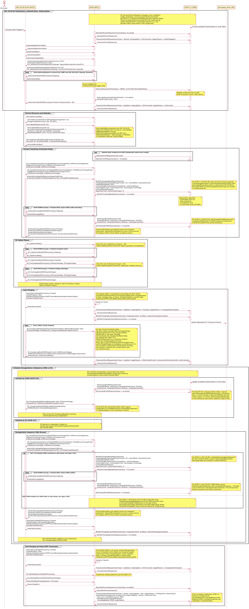

# ISO 15118-20 DC Scheduled Charging + OCPP 2.1 Sequence Diagram

## Key Actors:
- **EV driver:** The person charging the vehicle. Plugs in the cable, authenticates via PnC (certificate-based), and unplugs the connector when finished.
- **ISO 15118-20 EV (EVCC):** Electric Vehicle Communication Controller supporting ISO 15118-20 DC charging with Scheduled control mode.
- **EVSE (SECC):** Supply Equipment Communication Controller interfacing between EV (ISO 15118-20) and CSMS (OCPP 2.1).
- **OCPP 2.1 CSMS:** Charge Station Management System providing authorization, smart charging profiles, and transaction management with ISO 15118-20 awareness.
- **Secondary Actor (SA):** Supplies grid constraints, tariff tables, or aggregated schedule updates. Could be an Energy Management System (EMS) or grid operator.

---

## 1. Initialization, Authentication, and Authorization (ISO 15118-20 + OCPP 2.1)

### Session Establishment
1. EV driver plugs in cable, triggering communication.
2. EVSE sends `StatusNotificationRequest` (connectorStatus: "Occupied") and `TransactionEventRequest` (eventType = `Started`, chargingState = `EVConnected`, triggerReason = `CablePluggedIn`) to CSMS.

**Insight:** Cable plug-in creates the transaction in CSMS before the ISO 15118-20 session begins.

### Protocol Negotiation
1. EV and EVSE exchange `SupportedAppProtocolReq/Res` to agree on ISO 15118-20 protocol version.
2. `SessionSetupReq/Res` establishes session with EVSE Session ID.

### Plug & Charge (PnC) Certificate-Based Authentication
1. EV sends `AuthorizationSetupReq`, EVSE responds with `AuthorizationSetupRes` (`AuthorizationServices: [PnC]`, `CertificateInstallationService: false`, `PnC_ASResAuthorizationMode(GenChallenge, SupportedProviders[ProviderID*])`).
2. EV sends `AuthorizationReq` with `SelectedAuthorizationService: PnC` and `PnC_AReqAuthorizationMode` containing:
   - `GenChallenge` (echoed from AuthorizationSetupRes for replay protection)
   - `ContractCertificateChain` (contract certificate + sub-CA chain)
   - The entire `PnC_AReqAuthorizationMode` element is **digitally signed** with the private key associated with the contract certificate
3. EVSE loops `AuthorizationRes` (EVSEProcessing = `Ongoing`) while forwarding to CSMS.
4. EVSE **extracts the eMAID from the contract certificate's X.509 subject field** and sends `AuthorizeRequest` to CSMS with `idToken` (type = `eMAID`) and `iso15118CertificateHashData`.
5. CSMS validates certificate chain via PKI (multi-root path-building, OCSP revocation check: 5-60s latency).
6. CSMS returns `AuthorizeResponse` (idTokenInfo(status = `Accepted`)).
7. EVSE sends final `AuthorizationRes` (EVSEProcessing = `Finished`, ResponseCode = `OK`) to EV.
8. EVSE sends `TransactionEventRequest` (eventType = `Updated`, triggerReason = `Authorized`) to CSMS.

**Insight:** PnC is the primary authentication method in ISO 15118-20. Unlike ISO 15118-2, where the eMAID was sent as an explicit field in `PaymentDetailsReq`, in ISO 15118-20 the eMAID is embedded in the contract certificate's subject field and extracted by the SECC. The `GenChallenge` provides replay protection. `SupportedProviders` lets the EV select the correct contract certificate when multiple eMSP contracts are available. The mandatory `CertificateInstallationService` boolean tells the EV whether the SECC accepts a `CertificateInstallationReq` for installing or updating the contract certificate (set to `false` when the EV already has a valid contract cert). OCSP revocation checks add 5 to 60s latency depending on network conditions.

---

## 2. Service Discovery and Selection

1. EV sends `ServiceDiscoveryReq`, EVSE responds with `ServiceDiscoveryRes` (`ServiceRenegotiationSupported: true`, `EnergyTransferServiceList: [DC, DC_BPT]`).
2. EV sends `ServiceDetailReq` (serviceID: `DC`), EVSE responds with `ServiceDetailRes` (serviceID: `DC`, serviceParameterList: `ParameterSet(ParameterSetID: 1, Connector: Extended, ControlMode: Scheduled, MobilityNeedsMode: EVCC, Pricing: AbsolutePricing)`).
3. EV sends `ServiceSelectionReq` (`SelectedEnergyTransferService(ServiceID: DC, ParameterSetID: 1)`, `SelectedVASList`[opt]), EVSE confirms with `ServiceSelectionRes`.

**Insight:** ISO 15118-20 generalizes from "PaymentServiceSelection" (ISO 15118-2) to "ServiceSelection" to cover all services. DC is selected for this diagram; alternatives include AC, DC_BPT (bidirectional), AC_BPT, WPT (wireless), ACDP (automated connection).

**ServiceDetailRes parameters per ISO 15118-20 Table 207 [V2G20-1357]** for the unidirectional DC service: `Connector` (Core/Extended/Dual2/Dual4), `ControlMode` (Scheduled/Dynamic), `MobilityNeedsMode` (EVCC-provided / SECC-allowed - SECC-allowed is forbidden in Scheduled mode per [V2G20-2666]), `Pricing` (NoPricing/AbsolutePricing/PriceLevels). The DC service has no `BPTChannel` or `GeneratorMode` (those are BPT-only, in Table 208).

**ServiceSelectionReq carries both `ServiceID` AND `ParameterSetID`** inside `SelectedEnergyTransferService` (per ISO 15118-20 Table 119 SelectedServiceType): the `ParameterSetID` selects which specific parameter set (from the list offered in `ServiceDetailRes`) the EV is committing to.

---

## 3. Charge Scheduling (Scheduled Control Mode)

This section follows OCPP 2.1 use case **K18 (ISO 15118-20 Scheduled Control Mode)** Figure 142 ordering: `DC_ChargeParameterDiscoveryReq/Res` is a single round-trip between EV and EVSE with no CSMS involvement, and the SECC only contacts the CSMS once it has received `ScheduleExchangeReq` (which carries `departureTime` and `EVTargetEnergyRequest`).

### Default Tariff Configuration (independent station-level config)
Optional and independent of the per-transaction K18 flow, may occur at any prior time:
1. CSMS sends `SetDefaultTariffRequest` (`evseId`, `tariff`) tying a default tariff to the EVSE.
2. EVSE responds `SetDefaultTariffResponse` (status = `Accepted`).

**Insight:** `SetDefaultTariffRequest` is a station-level config message keyed by `evseId`, not part of the per-transaction K18 message exchange. OCPP 2.1 introduces native tariff management here (replacing the vendor-specific `DataTransferRequest` used in OCPP 2.0.1).

### EV/EVSE Charge Parameter Discovery (single round-trip)
1. EV sends `DC_ChargeParameterDiscoveryReq` with the six min/max limit pairs: `EVMaximumChargePower`, `EVMinimumChargePower`, `EVMaximumChargeCurrent`, `EVMinimumChargeCurrent`, `EVMaximumVoltage`, `EVMinimumVoltage` (all mandatory per `V2G_CI_DC.xsd` `DC_CPDReqEnergyTransferModeType`; optional `TargetSOC` may also be included).
2. EVSE responds `DC_ChargeParameterDiscoveryRes` with the matching six EVSE limit pairs: `EVSEMaximumChargePower`, `EVSEMinimumChargePower`, `EVSEMaximumChargeCurrent`, `EVSEMinimumChargeCurrent`, `EVSEMaximumVoltage`, `EVSEMinimumVoltage` (all mandatory per `DC_CPDResEnergyTransferModeType`).

**Insight:** Per K18 Figure 142, this round-trip is purely between EV and EVSE. There is no `EVSEProcessing=Ongoing` loop and no CSMS message at this step. The EV's `departureTime` and `EVTargetEnergyRequest` (which the SECC needs to forward to the CSMS) live in `ScheduleExchangeReq`, not in `DC_ChargeParameterDiscoveryReq`.

### Schedule Exchange and CSMS Optimization
1. EV sends `ScheduleExchangeReq` with `MaximumSupportingPoints` (range 12 to 1024) and `Scheduled_SEReqControlMode(DepartureTime, EVTargetEnergyRequest)`.
2. EVSE forwards the EV's needs to CSMS via `NotifyEVChargingNeedsRequest` with: `evseId`, `chargingNeeds(requestedEnergyTransfer: DC, controlMode: ScheduledControl, mobilityNeedsMode: EVCC, v2xChargingParameters(...), departureTime)`, `maxScheduleTuples: 3`.
3. CSMS acknowledges `NotifyEVChargingNeedsResponse(status = Accepted)`.
4. CSMS runs its optimization algorithm considering tariff tables from SA, grid constraints, EV departure time, and current load across all EVSEs.
5. While the CSMS computes a schedule, the EVSE loops `ScheduleExchangeRes(EVSEProcessing = Ongoing)` and the EV resends `ScheduleExchangeReq()` until the SECC has a schedule to return.
6. CSMS sends `SetChargingProfileRequest` with `chargingProfile(id, stackLevel, chargingProfilePurpose: TxProfile, transactionId, chargingProfileKind: Absolute, chargingSchedule[])`.
7. EVSE responds `SetChargingProfileResponse(status = Accepted)`.
8. EVSE returns the final `ScheduleExchangeRes(EVSEProcessing = Finished, Scheduled_SEResControlMode(ScheduleTuple[1..3](ChargingSchedule(PowerSchedule, {AbsolutePriceSchedule | PriceLevelSchedule}))))`.

**Insight on `v2xChargingParameters` (K18.FR.06):** Per OCPP 2.1 K18.FR.06: *"The NotifyEVChargingNeedsRequest SHALL contain V2XChargingParametersType instead of ACChargingParametersType or DCChargingParametersType."* The naming is misleading: `V2XChargingParametersType` is the generic ISO 15118-20 charging-parameters container, used for both unidirectional and BPT sessions. `dcChargingParameters` (DCChargingParametersType) is reserved for ISO 15118-2. For unidirectional DC the discharge fields of `v2xChargingParameters` are simply omitted; the populated fields are `maxChargePower`, `minChargePower`, `maxChargeCurrent`, `minChargeCurrent`, `maxVoltage`, `minVoltage`, and `evTargetEnergyRequest`.

**Insight on `transactionId` (K18.FR.07):** When `chargingProfilePurpose = TxProfile`, OCPP 2.1 K18.FR.07 requires `transactionId` to bind the profile to the active transaction. The CSMS is expected to send the profile within 60 seconds (K18.FR.08) so that the SECC can return its `ScheduleExchangeRes(Finished)` before the ISO 15118-20 ScheduleExchange timeout expires.

**Insight on Scheduled vs Dynamic:** `ScheduleExchangeReq/Res` is MANDATORY in both Scheduled and Dynamic modes; the difference is the inner control-mode element (`Scheduled_SEReqControlMode`/`Scheduled_SEResControlMode` vs `Dynamic_*`). `controlMode: ScheduledControl` tells the CSMS that the EV expects a full schedule rather than single setpoints. `mobilityNeedsMode: EVCC` means the EV controls its own schedule (CSMS cannot update departure time).

**Pricing nesting:** Per `V2G_CI_CommonMessages.xsd`, `Scheduled_SEResControlMode` contains only `ScheduleTuple[1..3]`. Each `ScheduleTuple` contains a `ChargingSchedule` whose `PowerSchedule` is mandatory and whose price schedule is an optional choice between `AbsolutePriceSchedule` (exact currency prices) and `PriceLevelSchedule` (abstract levels, 0 = cheapest). The EV displays the tariff to the driver before accepting the session.

---

## 4. DC Safety Phases (ISO 15118-20 Specific)

### Cable Check
1. EV sends `DC_CableCheckReq` (no additional parameters in ISO 15118-20; `EVReady` was removed from ISO 15118-2).
2. EVSE performs insulation test and safety checks, looping `DC_CableCheckRes` (EVSEProcessing = `Ongoing`) until complete.
3. EVSE responds `DC_CableCheckRes` (EVSEProcessing = `Finished`).

**Timing:** V2G_EVCC_DC_CableCheck_Timeout = 40s per spec.

**Insight:** Cable check validates electrical safety before high-voltage connection and implements the IEC 61851-23 safety requirements.

### Pre-Charge
1. EV sends `DC_PreChargeReq` with `EVProcessing`, `EVPresentVoltage`, and `EVTargetVoltage` (note: `EVTargetCurrent` was in ISO 15118-2, not -20).
2. EVSE adjusts output voltage to match EV battery voltage before contactor closure.
3. EVSE responds `DC_PreChargeRes` with `EVSEPresentVoltage`.

**Timing:** V2G_EVCC_DC_PreCharge_Timeout = 10s per spec.

**Insight:** Pre-charge prevents an electrical arc when contactors close. Voltage matching is critical for battery safety.

---

## 5. Loop Charging

### Power Delivery Start
1. EV sends `PowerDeliveryReq` with `EVProcessing: Finished`, `ChargeProgress: Start`, and `EVPowerProfile(Scheduled_EVPPTControlMode(SelectedScheduleTupleID), EVPowerProfileEntries)`. The mandatory `EVProcessing` field signals that the EV has finished any pre-conditions for the requested transition.
2. EVSE closes contactors.
3. EVSE responds `PowerDeliveryRes`.
4. EVSE sends `TransactionEventRequest` (eventType = `Updated`, chargingState = `Charging`, triggerReason = `ChargingStateChanged`).
5. EVSE sends `NotifyEVChargingScheduleRequest` to CSMS with: `evseId`, `chargingSchedule`, `timeBase`, `selectedChargingScheduleId`.
6. CSMS acknowledges `NotifyEVChargingScheduleResponse` (status = `Accepted`).
7. CSMS may forward aggregated schedule to Secondary Actor for grid management.

**Insight on ordering (K18 Figure 142):** Per OCPP 2.1 §K.18 Figure 142, the `TransactionEventRequest(ChargingStateChanged, Charging)` is sent BEFORE the `NotifyEVChargingScheduleRequest`. This ordering lets the CSMS see the transaction state transition (idle to charging) before processing the EV's calculated schedule.

**Insight on `SelectedScheduleTupleID` (V2G20-1546):** Per [V2G20-1546]: *"In all control modes the parameter EVPowerProfile, and in Scheduled Control Mode also the parameter ScheduleTupleID, shall be sent if the parameter ChargeProgress in PowerDeliveryReq message is set to 'Start', 'Standby', 'Stop' or 'Pause'."* In Scheduled mode the `ScheduleTupleID` is carried inside `EVPowerProfile.Scheduled_EVPPTControlMode.SelectedScheduleTupleID`, identifying which of the (up to three) schedule tuples the EV chose to follow. `NotifyEVChargingScheduleRequest` reports the EV's calculated schedule back to the CSMS, enabling aggregated load forecasting.

### DC Charge Loop (High-Frequency Control)
1. Loop every 250ms during charging:
   - EV sends `DC_ChargeLoopReq` with: `MeterInfoRequested` (boolean, mandatory), `EVPresentVoltage`, `Scheduled_DC_CLReqControlMode` carrying **either `EVTargetVoltage` OR `EVTargetCurrent`** (never both, per [V2G20-2183]), and optional `DisplayParameters` (e.g., `PresentSOC`, `TargetSOC`, `MaximumSOC`).
   - EVSE responds `DC_ChargeLoopRes` with: `EVSEPresentCurrent`, `EVSEPresentVoltage`, `EVSEPowerLimitAchieved`, `EVSECurrentLimitAchieved`, `EVSEVoltageLimitAchieved`, `Scheduled_DC_CLResControlMode`.
2. Periodically, EVSE sends `TransactionEventRequest(eventType = Updated, triggerReason = MeterValuePeriodic)` to CSMS with the periodic meterValue[] payload (per OCPP 2.1 Part 2 J. Meter Values, transaction-related meter values are never sent in standalone MeterValuesRequest).

**Insight:** Per ISO 15118-20 [V2G20-2183]: *"In a DC_ChargeLoopReq the EVCC shall either provide a EVTargetVoltage or EVTargetCurrent value. The EVCC shall never provide both values in the same message."* All other `Scheduled_DC_CLReqControlMode` fields (energy requests, max charge power/current/voltage limits) are optional per Table 174. `MeterInfoRequested` is a mandatory boolean at the `DC_ChargeLoopReq` top level (per Table 175): set to `true` to request the EVSE to include `MeterInfo` in the corresponding `DC_ChargeLoopRes`. The EV includes SoC in optional `DisplayParameters` for the EVSE display, unlike ISO 15118-2 AC where SoC is not available to the EVSE.

**Schema vs requirement note:** `V2G_CI_DC.xsd` declares both `EVTargetCurrent` and `EVTargetVoltage` as mandatory in `Scheduled_DC_CLReqControlModeType` (no `minOccurs="0"`), which contradicts the either/or constraint in [V2G20-2183]. The normative requirement overrides the schema; in practice implementations send one meaningful value and a sentinel for the other so the message remains XSD-valid.

---

## 6. Schedule Renegotiation

ISO 15118-20 renegotiation is architecturally different from ISO 15118-2. In -2, renegotiation halted the charge loop: the EV sent `PowerDeliveryReq(Renegotiate)` and re-entered `ChargeParameterDiscoveryReq/Res`. In -20, renegotiation uses a **parallel side stream** (V2GTP `ScheduleRenegotiationPayloadID`) while the main charge loop (`DC_ChargeLoopReq/Res` at 250ms) continues uninterrupted [V2G20-1045].

Both K16 (CSMS-initiated) and K17 (EV-initiated) renegotiation paths share the ISO 15118-20 side-stream opening (CPD round-trip, then `ScheduleExchangeReq`) per [V2G20-1046, V2G20-1052]. They diverge at the OCPP layer: K17 (Figure 141) routes `NotifyEVChargingNeedsRequest` and `SetChargingProfileRequest` through the CSMS during the side stream; K16 (Figure 139) delivers `SetChargingProfileRequest` BEFORE the side stream begins, so no CSMS traffic appears on the side stream itself.

### Initiated by CSMS (OCPP Use Case K16)
1. Secondary Actor sends an updated PmaxSchedule or tariff table to CSMS.
2. CSMS sends `SetChargingProfileRequest` (`chargingProfile(id, stackLevel, chargingProfilePurpose: TxProfile, transactionId, chargingProfileKind: Absolute, chargingSchedule[])`) to EVSE.
3. EVSE responds `SetChargingProfileResponse` (status = `Accepted`) per [K16.FR.01].
4. On the next main-stream `DC_ChargeLoopReq`, EVSE responds with `DC_ChargeLoopRes(EVSEStatus(NotificationMaxDelay, EVSENotification=ScheduleRenegotiation))` per [K16.FR.02] and [V2G20-1845].
5. EV opens the side stream and proceeds to the side-stream sequence below using the **K16 branch**.

**Insight:** The main-stream `DC_ChargeLoopReq/Res` continues uninterrupted during renegotiation. `EVSENotification` is wrapped inside the `EVSEStatus` element (alongside `NotificationMaxDelay`), per `V2G_CI_CommonTypes.xsd` `EVSEStatusType`. In K16 the `SetChargingProfileRequest` is delivered BEFORE the trigger, so no further `SetChargingProfileRequest` and no `NotifyEVChargingNeedsRequest` are exchanged on the side stream (Figure 139 explicitly annotates: *"Charging station does not send NotifyEVChargingNeeds"*).

### Initiated by EV (OCPP Use Case K17)
EV decides to renegotiate (for example after an updated departure time or different energy request) and opens the side stream (`ScheduleRenegotiationPayloadID`). Per [V2G20-1846] the EVCC may only do this after sending at least one `DC_ChargeLoopReq` on the main stream. The side stream lets the EV negotiate without interrupting the active charge loop. The EV path then enters the side-stream sequence below using the **K17 branch**.

### Renegotiation Side-Stream Sequence
The shared opening (steps 1 to 3) mirrors ISO 15118-20 [V2G20-1046, V2G20-1052, V2G20-1048]. Steps 4 to 7 are K17-only (Figure 141); the K16 branch skips them per Figure 139. Steps 8 to 12 converge again.

1. EV sends `DC_ChargeParameterDiscoveryReq` on the side stream with the six min/max limit pairs (`EVMaximumChargePower`, `EVMinimumChargePower`, `EVMaximumChargeCurrent`, `EVMinimumChargeCurrent`, `EVMaximumVoltage`, `EVMinimumVoltage`). Per [V2G20-1046] this is the first message on the side stream.
2. EVSE responds `DC_ChargeParameterDiscoveryRes` with the matching EVSE limits. This is a single round-trip with no CSMS involvement.
3. EV sends `ScheduleExchangeReq` (`MaximumSupportingPoints`, `Scheduled_SEReqControlMode(DepartureTime, EVTargetEnergyRequest)`) on the side stream per [V2G20-1048].

**K17 branch only (steps 4 to 7), per Figure 141:**

4. EVSE forwards the EV's needs to CSMS via `NotifyEVChargingNeedsRequest(evseId, chargingNeeds(requestedEnergyTransfer: DC, controlMode: ScheduledControl, mobilityNeedsMode: EVCC, v2xChargingParameters(...), departureTime), maxScheduleTuples: 3)`. Per [K17.FR.06], `V2XChargingParameters` is required for ISO 15118-20 (discharge fields omitted in unidirectional DC).
5. CSMS acknowledges `NotifyEVChargingNeedsResponse(status = Accepted)`.
6. EVSE loops `ScheduleExchangeRes(EVSEProcessing = Ongoing)` and the EV resends `ScheduleExchangeReq()` until the SECC has the new schedule.
7. CSMS sends `SetChargingProfileRequest` (`chargingProfilePurpose: TxProfile`, `transactionId`, up to three `chargingSchedule[]`) per [K17.FR.07]; EVSE responds `SetChargingProfileResponse(status = Accepted)`. This is the canonical loop-exit trigger.

**K16 branch only:** Skip steps 4 to 7. The profile was already delivered before the trigger (see §6 "Initiated by CSMS" step 2 above). The `ScheduleExchangeRes` returns directly without an `EVSEProcessing = Ongoing` loop, per Figure 139.

**Converged path (both K16 and K17):**

8. EVSE sends `ScheduleExchangeRes(EVSEProcessing = Finished, Scheduled_SEResControlMode(ScheduleTuple[1..3](ChargingSchedule(PowerSchedule, {AbsolutePriceSchedule | PriceLevelSchedule}))))`.
9. EV sends `PowerDeliveryReq(EVProcessing: Finished, ChargeProgress = ScheduleRenegotiation, EVPowerProfile(Scheduled_EVPPTControlMode(SelectedScheduleTupleID), EVPowerProfileEntries))` on the side stream.
10. EVSE responds `PowerDeliveryRes`.
11. EVSE sends `NotifyEVChargingScheduleRequest` to CSMS with the new schedule.
12. New `EVPowerProfile` is applied in the next main-stream `DC_ChargeLoopReq` [V2G20-1050].

**Insight:** The `ChargeProgress=ScheduleRenegotiation` value in `PowerDeliveryReq` is unique to -20 (not present in -2). The entire renegotiation sequence runs on the side stream while 250ms charge loop messages continue on the main stream. Per K17 Figure 141 the SECC sends `NotifyEVChargingNeedsRequest` once it has received `ScheduleExchangeReq` (not at `DC_ChargeParameterDiscoveryReq`), because the energy-request and departure-time fields the CSMS needs live in `Scheduled_SEReqControlMode`, not in CPD. Note that K17.FR.07 (Scheduled) does not explicitly require `transactionId` in its text; the binding requirement comes from K18.FR.07 governing the active transaction. Per [V2G20-1546] the `PowerDeliveryReq` carries `EVPowerProfile` AND `ScheduleTupleID` (inside `Scheduled_EVPPTControlMode`) when `ChargeProgress` is `Start`, `Standby`, `Stop`, or `Pause`, including the `ScheduleRenegotiation` confirmation flow.

---

## 7. End Charging and Stop OCPP Transaction

### Stop Charging
1. EV sends `PowerDeliveryReq` (`EVProcessing: Finished`, `ChargeProgress: Stop`, `EVPowerProfile(Scheduled_EVPPTControlMode(SelectedScheduleTupleID), EVPowerProfileEntries)`). Per [V2G20-1546]: *"In all control modes the parameter EVPowerProfile, and in Scheduled Control Mode also the parameter ScheduleTupleID, shall be sent if the parameter ChargeProgress in PowerDeliveryReq message is set to 'Start', 'Standby', 'Stop' or 'Pause'."* The ScheduleTupleID is carried inside `Scheduled_EVPPTControlMode.SelectedScheduleTupleID`.
2. EVSE opens contactors.
3. EVSE responds `PowerDeliveryRes`.
4. EVSE sends `TransactionEventRequest` (eventType = `Updated`, chargingState = `EVConnected`, triggerReason = `ChargingStateChanged`).

### Welding Detection
1. EV sends `DC_WeldingDetectionReq(EVProcessing)`.
2. EVSE checks for contactor welding by measuring voltage after the contactors should be open.
3. EVSE responds `DC_WeldingDetectionRes` with `EVSEPresentVoltage`.

**Note:** Welding detection is **mandatory** in ISO 15118-20 per [V2G20-1448] and [V2G20-2020]. This is a change from ISO 15118-2, where it was optional.

**Insight:** Welding detection implements the IEC 61851-23 safety requirement. If the contactors are welded closed, voltage remains present, indicating a safety hazard.

### Session Stop
1. EV sends `SessionStopReq(ChargingSession: Terminate)`.
2. EVSE responds `SessionStopRes`.
3. EVSE sends `StatusNotificationRequest` (connectorStatus: `Available`).
4. EVSE sends final `TransactionEventRequest` (eventType = `Ended`, chargingState = `Idle`, triggerReason = `EVDeparted`, `meterValue[]`) carrying the final cumulative `Energy.Active.Import.Register` (50.0 kWh) with `context: Transaction.End` and `signedMeterValue` (OCMF).
5. CSMS acknowledges both requests.

**Insight:** The transaction ends after a clean session stop. `ChargingSession: Terminate` is mandatory in the ISO 15118-20 `SessionStopReq`. `triggerReason = EVDeparted` is used for normal termination (vs `EVCommunicationLost` for abnormal). The final `meterValue[]` carries the cumulative session totals used for billing; which measurands appear is governed by `SampledDataCtrlr.TxEndedMeasurands` (OCPP 2.1 Section J). This is the OCPP 2.1 equivalent of the OCPP 1.6J `StopTransaction.req.meterStop` plus optional `transactionData[]`; OCPP 2.1 forbids transaction-related readings in standalone `MeterValuesRequest`.

---

## Key Differences: ISO 15118-20 vs ISO 15118-2

| Aspect | ISO 15118-2 | ISO 15118-20 (This Diagram) |
|--------|-------------|------------------------------|
| Charge loop message | `CurrentDemandReq/Res` | `DC_ChargeLoopReq/Res` |
| Service selection | `PaymentServiceSelectionReq/Res` | `ServiceSelectionReq/Res` |
| Schedule exchange | Not present | `ScheduleExchangeReq/Res` (Scheduled and Dynamic modes) |
| Control modes | Single implicit mode | Explicit Scheduled vs Dynamic modes |
| Safety phases | `CableCheckReq`, `PreChargeReq` | `DC_CableCheckReq`, `DC_PreChargeReq` |
| Cable check params | `CableCheckReq(EVReady)` | `DC_CableCheckReq()` (no EVReady in -20) |
| Pre-charge params | `PreChargeReq(EVTargetVoltage, EVTargetCurrent)` | `DC_PreChargeReq(EVProcessing, EVPresentVoltage, EVTargetVoltage)` (no EVTargetCurrent in -20) |
| PnC authentication | `PaymentServiceSelectionReq` + `PaymentDetailsReq(EMAID, CertChain)` + `AuthorizationReq` (3 pairs) | `AuthorizationSetupReq(GenChallenge)` + `AuthorizationReq(PnC_AReqAuthorizationMode [signed])` (2 pairs) |
| eMAID handling | Explicit field in `PaymentDetailsReq` | Extracted from contract certificate X.509 subject by SECC |
| Welding detection | `WeldingDetectionReq` (optional: EV could skip to SessionStop) | `DC_WeldingDetectionReq` (mandatory per [V2G20-1448]) |
| Renegotiation | Halts charge loop; `PowerDeliveryReq(Renegotiate)` then re-enters `ChargeParameterDiscoveryReq/Res` | Parallel side stream (ScheduleRenegotiationPayloadID); charge loop continues uninterrupted [V2G20-1045] |

## Key Differences: OCPP 2.0.1 vs OCPP 2.1

| Aspect | OCPP 2.0.1 | OCPP 2.1 (This Diagram) |
|--------|------------|--------------------------|
| Control mode field | Not present | `controlMode: ScheduledControl` in `NotifyEVChargingNeedsRequest` |
| Mobility needs mode | Not present | `mobilityNeedsMode: EVCC` in `NotifyEVChargingNeedsRequest` |
| EV schedule reporting | Not present | `NotifyEVChargingScheduleRequest` (Scheduled mode only) |
| Operation mode (BPT) | Not present | `operationMode` in `SetChargingProfileRequest` (for charge/discharge) |
| Tariff management | Vendor-specific via `DataTransferRequest` | Native `SetDefaultTariffRequest`, `GetTariffsRequest`, `ClearTariffsRequest`, `ChangeTransactionTariffRequest`, `CostUpdatedRequest` |

---

## References
- [ISO 15118-20:2022 - Vehicle to Grid Communication Interface](https://www.iso.org/standard/77845.html)
- [OCPP 2.1 Edition 1 (2025-01-23)](https://openchargealliance.org/protocols/open-charge-point-protocol/)
- PlantUML source: `iso15118_20_dc-ocpp21_scheduled.puml`
- Related diagrams:
  - `../iso15118_20_dc-ocpp21_dynamic/` (Dynamic control mode variant)
  - `../iso15118_20_dc_bpt-ocpp21_dynamic/` (Bidirectional power transfer)