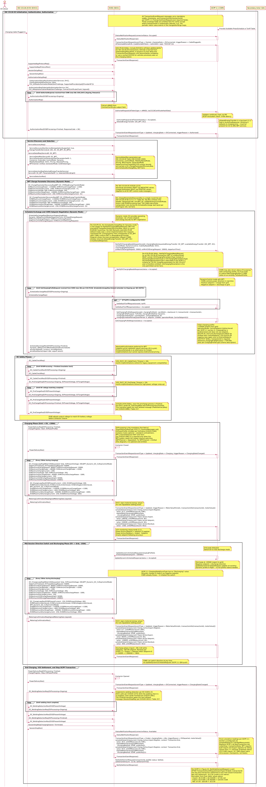

# ISO 15118-20 DC BPT + OCPP 2.1 (Dynamic Control Mode) Sequence Diagram

## Key Actors:
- **EV driver:** The person charging the vehicle. Plugs in the cable, authenticates via PnC (certificate-based), and unplugs the connector when finished. In fleet scenarios (buses, delivery vans), the driver may not interact. The CSMS controls charge/discharge automatically.
- **ISO 15118-20 EV (EVCC):** Electric Vehicle Communication Controller supporting ISO 15118-20 DC Bidirectional Power Transfer (DC_BPT) with Dynamic control mode. Declares both charge and discharge limits, executes charge and discharge loops with signed current values, and yields scheduling authority to the CSMS while communicating constraints (departure time, target energy, V2X energy bounds).
- **EVSE (SECC):** Supply Equipment Communication Controller interfacing between EV (ISO 15118-20) and CSMS (OCPP 2.1). Advertises DC_BPT capability, enforces safety limits, and applies CSMS setpoints to DC power modules. Operates contactors bidirectionally for both import and export power flow.
- **OCPP 2.1 CSMS:** Charge Station Management System providing authorization, real-time bidirectional setpoint control, V2G settlement, and transaction management with ISO 15118-20 awareness. Calculates optimal charge/discharge setpoints based on grid conditions, energy market prices, fleet SoC distribution, and demand response signals.
- **Secondary Actor (SA):** Supplies grid constraints, tariff tables, demand response signals, energy market prices (wholesale spot, feed-in tariff), or aggregated load updates. Could be an Energy Management System (EMS), grid operator, fleet manager, or wholesale market data feed.

---

## 1. Initialization, Authentication, and Authorization (ISO 15118-20 + OCPP 2.1)

### Session Establishment
1. EV driver plugs in cable, triggering communication.
2. EVSE sends `StatusNotificationRequest` (connectorStatus: "Occupied") and `TransactionEventRequest` (eventType = `Started`, chargingState = `EVConnected`, triggerReason = `CablePluggedIn`) to CSMS.

**Insight:** Cable plug-in creates the transaction in CSMS before the ISO 15118-20 session begins.

**TransactionEventRequest envelope fields (OCPP 2.1):** Every `TransactionEventRequest` carries mandatory `seqNo`, `timestamp`, and `transactionInfo` (with `transactionId`) per the OCPP 2.1 schema (`TransactionEventRequest.json` required: `["eventType", "timestamp", "triggerReason", "seqNo", "transactionInfo"]`). These envelope fields are elided in this diagram for clarity; they are shown only where `transactionId` is contextually relevant, e.g., on the periodic `MeterValuePeriodic` events in the charge and discharge loops where the meter sample is tied to a specific transaction.

**EVCCID timing caveat (Q01.FR.02):** Per Q01.FR.02 SHALL, the `TransactionEventRequest(eventType=Started)` for an ISO 15118-20 transaction must include EVCCID in `idToken.additionalInfo` (with `type: "EVCCID"`). EVCCID is learned from `SessionSetupReq`, which runs after this notification in the diagram, so practical implementations either delay `TransactionEventRequest(Started)` until `SessionSetup` completes, or use a cached EVCCID for vehicles previously seen at this charging station.

### Protocol Negotiation
1. EV and EVSE exchange `SupportedAppProtocolReq/Res` to agree on ISO 15118-20 protocol version.
2. `SessionSetupReq/Res` establishes session with EVSE Session ID.

### Plug & Charge (PnC) Certificate-Based Authentication
1. EV sends `AuthorizationSetupReq`, EVSE responds with `AuthorizationSetupRes` (`AuthorizationServices: [PnC]`, `CertificateInstallationService: false`, `PnC_ASResAuthorizationMode(GenChallenge, SupportedProviders[opt][ProviderID*])`). `SupportedProviders` is optional per the V2G_CI_CommonMessages.xsd schema (`minOccurs="0"`); when present, it restricts which contract certificates the EV may select from.
2. EV sends `AuthorizationReq` with `SelectedAuthorizationService: PnC` and `PnC_AReqAuthorizationMode` containing:
   - `GenChallenge` (echoed from AuthorizationSetupRes for replay protection)
   - `ContractCertificateChain` (contract certificate + sub-CA chain)
   - The entire `PnC_AReqAuthorizationMode` element is **digitally signed** with the private key associated with the contract certificate
3. EVSE loops `AuthorizationRes` (EVSEProcessing = `Ongoing`) while forwarding to CSMS.
4. EVSE **extracts the eMAID from the contract certificate's X.509 subject field** and sends `AuthorizeRequest` to CSMS with `idToken` (type = `eMAID`) and `iso15118CertificateHashData`.
5. CSMS validates certificate chain via PKI (multi-root path-building, OCSP revocation check: 5-60s latency).
6. CSMS returns `AuthorizeResponse` (idTokenInfo(status = `Accepted`), `allowedEnergyTransfer: [DC_BPT, DC]`).
7. EVSE sends final `AuthorizationRes` (EVSEProcessing = `Finished`, ResponseCode = `OK`) to EV.
8. EVSE sends `TransactionEventRequest` (eventType = `Updated`, triggerReason = `Authorized`) to CSMS.

**Insight:** PnC is the primary authentication method in ISO 15118-20. Unlike ISO 15118-2, where the eMAID was sent as an explicit field in `PaymentDetailsReq`, in ISO 15118-20 the eMAID is embedded in the contract certificate's subject field and extracted by the SECC. The `GenChallenge` provides replay protection. `SupportedProviders` lets the EV select the correct contract certificate when multiple eMSP contracts are available. OCSP revocation checks add 5-60s latency depending on network conditions.

**BPT-specific:** `allowedEnergyTransfer` is a top-level OCPP 2.1 field on `AuthorizeResponse`. Omitting it defaults to charging only; it must be present and include `DC_BPT` for the EVSE to offer bidirectional services to the EV.

---

## 2. Service Discovery and Selection

1. EV sends `ServiceDiscoveryReq`, EVSE responds with `ServiceDiscoveryRes` (`ServiceRenegotiationSupported: true`, `EnergyTransferServiceList: [DC, AC, DC_BPT, AC_BPT]`).
2. EV sends `ServiceDetailReq` (`ServiceID: DC_BPT`), EVSE responds with `ServiceDetailRes` (`ServiceID: DC_BPT`, `ServiceParameterList: ParameterSet(ParameterSetID: 1, Connector: Extended, ControlMode: Dynamic, MobilityNeedsMode: EVCC, Pricing: AbsolutePricing, BPTChannel: Unified, GeneratorMode: GridFollowing)`).
3. EV sends `ServiceSelectionReq` (`SelectedEnergyTransferService(ServiceID: DC_BPT, ParameterSetID: 1)`, `SelectedVASList`[opt]), EVSE confirms with `ServiceSelectionRes`.

**Insight:** ISO 15118-20 generalizes from "PaymentServiceSelection" (ISO 15118-2) to "ServiceSelection" to cover all services. Presence of `DC_BPT` in the service list indicates EVSE supports V2G.

**ServiceDetailRes parameters per ISO 15118-20 Table 208 [V2G20-1360]:** the DC BPT service exposes exactly six parameters in the ParameterSet:

| Parameter | Values | Purpose |
|-----------|--------|---------|
| `Connector` | 1=Core, 2=Extended, 3=Dual2, 4=Dual4 | Connector type |
| `ControlMode` | 1=Scheduled, 2=Dynamic | Who computes the schedule |
| `MobilityNeedsMode` | 1=EVCC-provided, 2=SECC-allowed | Who provides departure time / energy targets |
| `Pricing` | 0=No pricing, 1=AbsolutePricing, 2=PriceLevels | Pricing structure used in offered schedules |
| `BPTChannel` | 1=Unified (single channel), 2=Separated (dual channel) | Power transfer channel topology |
| `GeneratorMode` | 1=GridFollowing, 2=GridForming | Power converter behaviour |

Note: `DepartureTime`, `TargetSOC`, and V2X energy bounds are NOT part of `ServiceDetailRes`; they are carried in `DC_ChargeParameterDiscoveryReq` and `ScheduleExchangeReq`.

**ServiceSelectionReq carries both `ServiceID` and `ParameterSetID`** inside `SelectedEnergyTransferService` (per ISO 15118-20 Table 119 SelectedServiceType): the `ParameterSetID` selects which specific parameter set (from the list offered in `ServiceDetailRes`) the EV is committing to.

---

## 3. BPT Charge Parameter Discovery and Schedule Exchange (Dynamic Mode)

### EV Charge Parameter Discovery (Single Round-Trip, Charge AND Discharge Limits)
1. EV sends `DC_ChargeParameterDiscoveryReq` with `BPT_DC_CPDReqEnergyTransferMode` containing **both charge and discharge limits** in a single message:
   - **Charge (positive values):** `EVMaximumChargePower: +150000`, `EVMinimumChargePower: +1000`, `EVMaximumChargeCurrent: +400`, `EVMinimumChargeCurrent: +5`, `EVMaximumVoltage: 900`, `EVMinimumVoltage: 200`
   - **Discharge (negative values):** `EVMaximumDischargePower: -100000`, `EVMinimumDischargePower: -1000`, `EVMaximumDischargeCurrent: -250`, `EVMinimumDischargeCurrent: -5`
2. EVSE responds `DC_ChargeParameterDiscoveryRes` with `BPT_DC_CPDResEnergyTransferMode` carrying the EVSE charge AND discharge envelope (`EVSEMaximumChargePower: +150000`, `EVSEMinimumChargePower: +1000`, `EVSEMaximumChargeCurrent: +400`, `EVSEMinimumChargeCurrent: +5`, `EVSEMaximumVoltage: 900`, `EVSEMinimumVoltage: 200`, `EVSEMaximumDischargePower: -100000`, `EVSEMinimumDischargePower: -1000`, `EVSEMaximumDischargeCurrent: -250`, `EVSEMinimumDischargeCurrent: -5`).

**Insight:** This is the defining message of BPT: it carries both charge AND discharge limits in a single exchange. The EV declares its full bidirectional envelope before the CSMS-side setpoint negotiation begins.

**CPD is a single round-trip:** Per ISO 15118-20 §8.3.4.5.2.3 / Table 59, `DC_ChargeParameterDiscoveryRes` contains only `Header`, `ResponseCode`, and `BPT_DC_CPDResEnergyTransferMode` (or `DC_CPDResEnergyTransferMode` for unidirectional). There is **no `EVSEProcessing` field**, so CPDRes cannot carry an `Ongoing/Finished` loop. The CSMS-side profile computation runs during the `ScheduleExchangeRes(EVSEProcessing=Ongoing)` wait band per K19 Figure 143 (see §3.2 below), not during CPD.

**Sign convention per ISO 15118-20 [V2G20-1213]:** *"Parameters used for discharging the EV battery shall be set with a negative value, parameters used for charging shall be set with positive value. The following shall also apply for DC BPT (refer to 8.3.5.5.7)."* This applies to all DC BPT control mode messages, including `BPT_DC_CPDReqEnergyTransferMode`, `BPT_DC_CPDResEnergyTransferMode`, `BPT_Dynamic_DC_CLReqControlMode`, and `BPT_Dynamic_DC_CLResControlMode`.

### Schedule Exchange and CSMS Setpoint Negotiation (Dynamic Mode)
Per **K19.FR.01** (Figure 143), the `ScheduleExchangeReq` for Dynamic mode is the trigger that causes the EVSE to forward charging needs to the CSMS via `NotifyEVChargingNeedsRequest`; this is **not** triggered by the preceding `ChargeParameterDiscoveryReq`. The `SetChargingProfileRequest` then arrives during the `ScheduleExchangeRes(EVSEProcessing=Ongoing)` wait band (per K19.FR.07 / K19.FR.08), before the final `ScheduleExchangeRes(EVSEProcessing=Finished)`.

1. EV sends `ScheduleExchangeReq` with `MaximumSupportingPoints` and `Dynamic_SEReqControlMode` (departureTime, EVTargetEnergyRequest, EVMaximumEnergyRequest, EVMinimumEnergyRequest, **EVMaximumV2XEnergyRequest, EVMinimumV2XEnergyRequest**).
2. Per K19.FR.01, EVSE forwards charging needs to CSMS via `NotifyEVChargingNeedsRequest` with: `evseId`, `chargingNeeds` (requestedEnergyTransfer: `DC_BPT`, availableEnergyTransfer: [`DC_BPT`, `DC`], **controlMode: `DynamicControl`**, **mobilityNeedsMode: `EVCC`**, **v2xChargingParameters(`evMaxV2XEnergyRequest: 50000`, `evMinV2XEnergyRequest: 10000`)**, departureTime). Note: per K19.FR.06 SHALL, `dcChargingParameters` is **not** included for ISO 15118-20 transactions (see callout below).
3. CSMS acknowledges with `NotifyEVChargingNeedsResponse` (status = `Accepted`). CSMS may also return `Processing` (still computing profile; CS waits) or `NoChargingProfile` (CSMS relies on an existing `TxDefaultProfile`).
4. While CSMS computes the charging profile, EVSE loops `ScheduleExchangeRes` (EVSEProcessing = `Ongoing`) and EV polls with `ScheduleExchangeReq()` until the `SetChargingProfileRequest` arrives. Per the Q01 NOTE on `ScheduleExchangeReq` timeout: the 2 s ScheduleExchangeReq timeout can be extended up to ~60 s by repeatedly returning `EVSEProcessing = Ongoing` (matches the K19.FR.08 SHOULD: CSMS sends the SetChargingProfileRequest within 60 s).
5. CSMS runs real-time optimization considering: tariff tables and demand response from SA, grid constraints, EV departure time, V2X energy bounds, current load across all EVSEs, energy market prices (import vs feed-in rate spread).
6. Optional: CSMS sends `SetDefaultTariffRequest` with tariff for the EVSE (native OCPP 2.1 tariff management; bidirectional pricing supported).
7. CSMS sends `SetChargingProfileRequest` with chargingProfile (`id: <profileId>`, `stackLevel: 0`, `transactionId: <transactionId>`, purpose: `TxProfile`, **kind: `Dynamic`**, chargingSchedule[] (`id: <scheduleId>`, `chargingRateUnit: W`, single chargingSchedulePeriod with `startPeriod: 0`, `setpoint: 150000` (W), **operationMode: `CentralSetpoint`**)).
8. EVSE responds `SetChargingProfileResponse` (status = `Accepted`).
9. EVSE sends final `ScheduleExchangeRes` (EVSEProcessing = `Finished`, `Dynamic_SEResControlMode` carrying `AbsolutePriceSchedule(priceScheduleID, currency, priceAlgorithm, priceRuleStacks(import rate, export rate))`) to EV.

**TxProfile `transactionId` (K19.FR.07 SHALL):** Per K19.FR.07, the CSMS-issued `SetChargingProfileRequest` for an ISO 15118-20 dynamic-control flow SHALL include both `chargingProfilePurpose = TxProfile` and a `transactionId`. The OCPP 2.1 `SetChargingProfileRequest` schema description on `ChargingProfileType.transactionId` reinforces this: *"SHALL only be included if ChargingProfilePurpose is set to TxProfile in a SetChargingProfileRequest. The transactionId is used to match the profile to a specific transaction."* The `transactionId` ties the dynamic profile (and any later `UpdateDynamicScheduleRequest` targeting `chargingProfileId`) to the specific in-flight OCPP transaction.

**Charging needs carrier (`v2xChargingParameters` is required, K19.FR.06 SHALL):** Per K19.FR.06, `NotifyEVChargingNeedsRequest` for an ISO 15118-20 transaction (BPT or unidirectional) **SHALL contain `V2XChargingParametersType` instead of `ACChargingParametersType` or `DCChargingParametersType`**. The OCPP 2.1 schema describes `DCChargingParametersType` as "EV DC charging parameters for ISO 15118-2", so it is shaped for the unidirectional 15118-2 case and is forbidden here. `V2XChargingParametersType` carries the V2X-specific fields (`evMax/MinV2XEnergyRequest`, `maxDischargePower`, `maxDischargeCurrent`, etc.) and is the only permitted carrier for ISO 15118-20.

**V2X energy bounds:** `v2xChargingParameters.evMaxV2XEnergyRequest` (50 kWh available for discharge) and `evMinV2XEnergyRequest` (10 kWh reserved for driving range) let the CSMS calculate safe discharge limits without depleting the battery below user-acceptable thresholds. `controlMode: DynamicControl` tells the CSMS that the EV yields scheduling authority and the CSMS will deliver instantaneous setpoints.

**Strict spec compliance (Q01 Remarks + Q01.FR.09):** Q01.FR.09 SHALL-requires the Charging Station to send `NotifyEVChargingNeedsRequest` with `requestedEnergyTransfer` set to its default (charging only AC/DC) under specific preconditions; Q01 Remarks (page 501) further advises *"to always start by requesting a ChargingOnly energy service, but indicate that the V2X service is available for this EV. Once the Charging Station receives the allowedEnergyTransfer including the V2X service from the CSMS, there can be a service renegotiation to change to the V2X service."* This diagram shows the **post-renegotiation** request because the CSMS already returned `allowedEnergyTransfer: [DC_BPT, DC]` in `AuthorizeResponse`, so the CS can request `DC_BPT` directly.

**Insight:** Dynamic mode delivers a **single instantaneous setpoint** (`chargingProfileKind: Dynamic`), not a full schedule. The CSMS can update this setpoint at any time during the charge loop without ISO 15118-20 renegotiation. For BPT, `operationMode: CentralSetpoint` is used (not `ChargingOnly`) because `ChargingOnly` is unidirectional and does not use a setpoint; `CentralSetpoint` is the bidirectional operation mode where positive setpoint = charge from grid and negative setpoint = discharge to grid. Per **Q03.FR.02**, `limit` and `dischargeLimit` MUST be omitted with `CentralSetpoint`; the V2X.03/V2X.04 capping rules apply only to `ExternalSetpoint`. `chargingProfileKind: Dynamic` and `operationMode` are OCPP 2.1 additions; OCPP 2.0.1 lacks both.

**Schedule Exchange semantics:** `ScheduleExchangeReq/Res` is MANDATORY in both Scheduled and Dynamic modes. In Dynamic BPT mode the EV communicates its **operating envelope** (target energy, energy bounds, V2X energy bounds) and the response uses `Dynamic_SEResControlMode`. **`AbsolutePriceSchedule` is preferred for BPT** because it carries explicit currency prices and supports bidirectional pricing (positive prices = import cost, negative prices = export earnings); `PriceLevelSchedule` is a simpler alternative but cannot express direction-dependent pricing, inadequate for V2G where import and export rates diverge significantly. The tariff shown here is an estimate; actual billing is reconciled via `NotifySettlementRequest` after the session.

---

## 4. DC Safety Phases (ISO 15118-20 Specific)

### Cable Check
1. EV sends `DC_CableCheckReq` (no additional parameters in ISO 15118-20; `EVReady` was removed from ISO 15118-2).
2. EVSE performs insulation test and safety checks, looping `DC_CableCheckRes` (EVSEProcessing = `Ongoing`) until complete.
3. EVSE responds `DC_CableCheckRes` (EVSEProcessing = `Finished`).

**Timing:** V2G_EVCC_DC_CableCheck_Timeout = 40s per spec.

**Insight:** Cable check validates electrical safety before high-voltage connection and implements the IEC 61851-23 safety requirements (typically 500V test, > 100 Ω/V leakage resistance threshold).

### Pre-Charge
1. EV sends `DC_PreChargeReq(EVProcessing=Ongoing, EVPresentVoltage, EVTargetVoltage)` (note: `EVTargetCurrent` was in ISO 15118-2, not -20). EVSE responds `DC_PreChargeRes(EVSEPresentVoltage)` and the EV continues polling with `EVProcessing=Ongoing` while voltage matching is in progress (per [V2G20-1433]).
2. EVSE adjusts output voltage to match EV battery voltage before contactor closure.
3. Once voltage matching is complete, EV sends a terminal `DC_PreChargeReq(EVProcessing=Finished, EVPresentVoltage, EVTargetVoltage)` per [V2G20-1434]; EVSE responds with a final `DC_PreChargeRes(EVSEPresentVoltage)`. The `Finished` transition is what gates the next allowed message (`PowerDeliveryReq`) per [V2G20-2006] / Table 217.

**Timing:** V2G_EVCC_DC_PreCharge_Timeout = 10s per spec.

**Insight:** Pre-charge prevents an electrical arc when contactors close. Voltage matching is critical for battery safety, especially for BPT where bidirectional power flow imposes the same inrush current concerns in both directions. The explicit `EVProcessing=Ongoing` to `EVProcessing=Finished` transition is normative: SECC state machine rules ([V2G20-2005] / [V2G20-2006]) only allow `PowerDeliveryReq` after receiving the `Finished` request, so omitting the terminal Finished message strands the session in PreCharge.

---

## 5. Charging Phase (Grid → EV, +200A)

### Power Delivery Start
1. EV sends `PowerDeliveryReq` (`EVProcessing: Finished`, ChargeProgress: `Start`, `EVPowerProfile`). `EVProcessing` is the mandatory first field of `PowerDeliveryReqType` per `V2G_CI_CommonMessages.xsd`.
2. EVSE closes contactors.
3. EVSE responds `PowerDeliveryRes`.
4. EVSE sends `TransactionEventRequest` (eventType = `Updated`, chargingState = `Charging`, triggerReason = `ChargingStateChanged`).

**Insight:** `EVPowerProfile` is required per [V2G20-1546] when `ChargeProgress` is `Start` / `Stop` / `Standby` / `Pause`: *"In all control modes the parameter EVPowerProfile, and in Scheduled Control Mode also the parameter ScheduleTupleID, shall be sent..."*. The schema marks `EVPowerProfile` as optional (Table 46 cardinality 0..1) which contradicts the normative requirement; this diagram follows the normative text. Note also that `Pause` appears in the [V2G20-1546] normative text but is NOT one of the values defined in the `chargeProgressType` schema enum (which lists only `Start`, `Stop`, `Standby`, `ScheduleRenegotiation`); this diagram therefore never emits `ChargeProgress = Pause`. In Dynamic mode `EVPowerProfile` is an EV best-effort prediction (per Table 46 semantics), used by the EVSE as planning orientation only; actual power flow is driven by CSMS setpoints.

**`BPT_ChannelSelection` is conditional, not always required.** Per [V2G20-1065]: *"If the BPT service was selected... and the reverse power transfer system requires HLC-based control of switching electricity power channels, the parameter BPT_ChannelSelection of PowerDeliveryReq shall be applied."* This diagram uses `BPTChannel: Unified` (single physical channel, advertised in `ServiceDetailRes`), so HLC channel switching is not needed and `BPT_ChannelSelection` is omitted. It would be required for `BPTChannel: Separated` (dual channel) systems.

### DC Charge Loop (High-Frequency Control, +200A)
1. Loop every 250ms during charging:
   - EV sends `DC_ChargeLoopReq` with: `MeterInfoRequested: false`, `EVPresentVoltage: 400`, and `BPT_Dynamic_DC_CLReqControlMode` carrying **the full mandatory field set** (charge AND discharge limits in every loop, regardless of current direction):
     - Energy: `EVTargetEnergyRequest: 60000`, `EVMaximumEnergyRequest: 80000`, `EVMinimumEnergyRequest: 10000`
     - Charge (positive): `EVMaximumChargePower: +80000`, `EVMinimumChargePower: +1000`, `EVMaximumChargeCurrent: +200`, `EVMaximumVoltage: 500`, `EVMinimumVoltage: 200`
     - Discharge (negative): `EVMaximumDischargePower: -60000`, `EVMinimumDischargePower: -1000`, `EVMaximumDischargeCurrent: -150`
     - Optional V2X: `EVMaximumV2XEnergyRequest: 50000`, `EVMinimumV2XEnergyRequest: 10000`
     - Optional: `DepartureTime`
   - EVSE responds `DC_ChargeLoopRes` with: `EVSEPresentCurrent: +200`, `EVSEPresentVoltage: 400`, `EVSEPowerLimitAchieved`, `EVSECurrentLimitAchieved`, `EVSEVoltageLimitAchieved`, and `BPT_Dynamic_DC_CLResControlMode` carrying the EVSE's full charge AND discharge envelope (`EVSEMaximumChargePower: +150000`, `EVSEMinimumChargePower: +1000`, `EVSEMaximumChargeCurrent: +400`, `EVSEMaximumVoltage: 900`, `EVSEMaximumDischargePower: -100000`, `EVSEMinimumDischargePower: -1000`, `EVSEMaximumDischargeCurrent: -250`, `EVSEMinimumVoltage: 200`).
2. EV periodically sends `MeteringConfirmationReq(SignedMeteringData [signed])`, EVSE responds `MeteringConfirmationRes`.
3. Periodically, EVSE sends `TransactionEventRequest(eventType = Updated, triggerReason = MeterValuePeriodic)` to CSMS with the periodic meterValue[] payload (per OCPP 2.1 Part 2 J. Meter Values, transaction-related meter values are never sent in standalone MeterValuesRequest). The payload includes `Energy.Active.Import.Register` (with `signedMeterValue` carrying OCMF-encoded data and publicKey), `Power.Active.Import`, `Power.Active.Setpoint`, and `Power.Active.Residual`.

**Insight:** Per ISO 15118-20 §8.3.5.5.7.3 (Table 179) and the V2G_CI_DC.xsd schema, every `BPT_Dynamic_DC_CLReqControlMode` MUST contain BOTH the inherited `Dynamic_DC_CLReqControlMode` charge fields AND the BPT-specific discharge fields - they are all mandatory (no `minOccurs="0"`), regardless of the current power direction. Direction is signalled by the OCPP setpoint sign and by `EVSEPresentCurrent`, NOT by which fields are present in `DC_ChargeLoopReq`.

The `MeterInfoRequested` boolean is mandatory in `DC_ChargeLoopReq` (per §8.3.5.5.1 Table 175); set to `true` to request the EVSE to include `MeterInfo` in the corresponding `DC_ChargeLoopRes`. `EVSEPresentCurrent` is signed (top-level field on `DC_ChargeLoopRes`): **+200A confirms charging direction (Grid → EV)**. `MeteringConfirmationReq` carries the EVCC's signed metered energy values for billing non-repudiation.

**V2X monitoring measurands (OCPP 2.1):** `Power.Active.Setpoint` is the setpoint the CS applied; `Power.Active.Residual` = Import - Setpoint, tracking setpoint-following accuracy. `Energy.Active.Import.Register` is the cumulative imported energy used for consumption-rate billing.

---

## 6. Mid-Session Direction Switch and Discharging Phase (EV → Grid, -150A)

This section demonstrates the defining capability of BPT: mid-session power direction reversal under real-time CSMS control.

### Direction Switch (Triggered by Grid Event)
1. CSMS receives signal from Secondary Actor (grid frequency drop, demand response event, wholesale price spike, fleet load balancing).
2. CSMS sends `UpdateDynamicScheduleRequest` (chargingProfileId, scheduleUpdate(`setpoint: -100000`)) to EVSE. Note: `UpdateDynamicScheduleRequest` targets a profile by `chargingProfileId` only.
3. EVSE responds `UpdateDynamicScheduleResponse` (status = `Accepted`).
4. EVSE applies the new setpoint to DC power modules (< 1s response time) on the next `DC_ChargeLoopRes`.

**Insight:** `UpdateDynamicScheduleRequest` (OCPP 2.1 Use Case Q04) is the in-flight setpoint update mechanism: it carries only the changed setpoint, not a full profile resend. **The negative setpoint (-100 kW) reverses power direction without re-running ISO 15118-20 negotiation.** No `TransactionEventRequest(ChargingStateChanged)` is sent because OCPP 2.1 `ChargingStateEnumType` has no "Discharging" value; the chargingState remains `Charging` (power is still actively flowing) and direction is implicit via the negative setpoint that the CSMS sent. The CSMS already knows the direction switched because it initiated the change.

### DC Discharge Loop (High-Frequency Control, -150A)
1. Loop every 250ms during discharging:
   - EV sends `DC_ChargeLoopReq` with **the same field set as during charging** - per the FDIS schema, charge AND discharge limits are always sent together. Only the actual measured `EVSEPresentCurrent` sign changes to indicate direction.
   - EVSE responds `DC_ChargeLoopRes` with: `EVSEPresentCurrent: -150` (negative = export), `EVSEPresentVoltage: 400`, `EVSEPowerLimitAchieved`, `EVSECurrentLimitAchieved`, `EVSEVoltageLimitAchieved`, and the same `BPT_Dynamic_DC_CLResControlMode` envelope as during charging.
2. EV periodically sends `MeteringConfirmationReq(SignedMeteringData [signed])`, EVSE responds `MeteringConfirmationRes`.
3. Periodically, EVSE sends `TransactionEventRequest(eventType = Updated, triggerReason = MeterValuePeriodic)` to CSMS with the periodic meterValue[] payload including `Energy.Active.Export.Register` (with signed meter value), `Power.Active.Export`, `Power.Active.Setpoint: -100000`, `Power.Active.Residual`.

**Insight:** The wire-level `BPT_Dynamic_DC_CLReqControlMode` payload is **identical** between charging and discharging loops - the EV does not "switch from sending charge limits to discharge limits" because the FDIS XSD makes both sets mandatory. Direction is communicated by:
- The OCPP setpoint sign (positive = charge, negative = discharge),
- The signed `EVSEPresentCurrent` (the EVSE reports actual measured direction),
- The `Energy.Active.Import.Register` vs `Energy.Active.Export.Register` measurand selection.

`Energy.Active.Export.Register` is a separate measurand from `Energy.Active.Import.Register`; separate registers ensure billing accuracy because import is billed at consumption rate and export is credited at feed-in rate (they typically differ significantly). The CSMS can switch direction at any time via another `UpdateDynamicScheduleRequest`. No renegotiation protocol required.

**V2X residual interpretation (OCPP 2.1):** During discharge, `Power.Active.Residual` = Export + Setpoint when Setpoint < 0 (e.g., 99200 + (-100000) = -800), indicating the EVSE is exporting ~99.2 kW while following a -100 kW setpoint.

### Power Direction Sign Convention

| Direction | Current Sign | Energy Register | OCPP operationMode | Power Flow |
|-----------|--------------|-----------------|--------------------|------------|
| **Charge** (Grid → EV) | **+200A** | `Energy.Active.Import.Register` | `CentralSetpoint` (positive setpoint) | Import from grid |
| **Discharge** (EV → Grid) | **-150A** | `Energy.Active.Export.Register` | `CentralSetpoint` (negative setpoint) | Export to grid |

`BPT_Dynamic_DC_CLReqControlMode` follows the electrical engineering convention: current direction relative to the battery positive terminal. A single control mode handles both directions, avoiding mode-switching overhead.

---

## 7. End Charging, V2G Settlement, and Stop OCPP Transaction

### Stop Charging
1. EV sends `PowerDeliveryReq` (`EVProcessing: Finished`, ChargeProgress: `Stop`, `EVPowerProfile`).
2. EVSE opens contactors.
3. EVSE responds `PowerDeliveryRes`.
4. EVSE sends `TransactionEventRequest` (eventType = `Updated`, chargingState = `EVConnected`, triggerReason = `ChargingStateChanged`).

### Welding Detection
1. EV sends `DC_WeldingDetectionReq(EVProcessing=Ongoing)`; EVSE responds `DC_WeldingDetectionRes(EVSEPresentVoltage)`. The EVCC continues to poll with `EVProcessing=Ongoing` per [V2G20-1573] while the welding check is in progress.
2. EVSE checks for contactor welding by measuring voltage after the contactors should be open.
3. Once the welding check is complete, EV sends a terminal `DC_WeldingDetectionReq(EVProcessing=Finished)` per [V2G20-1461]; EVSE responds with a final `DC_WeldingDetectionRes(EVSEPresentVoltage)`. The `Finished` transition gates the next allowed message (`SessionStopReq`) per [V2G20-1631] / Table 217.

**Note:** Welding detection is **mandatory** in ISO 15118-20 per [V2G20-1448] and [V2G20-2020]. This is a change from ISO 15118-2, where it was optional.

**Insight:** Welding detection implements the IEC 61851-23 safety requirement. If the contactors are welded closed, voltage remains present (typically > 20V threshold), indicating a safety hazard. Welding detection is especially important for BPT because contactors carry power in both directions and may experience increased mechanical wear.

### Session Stop and V2G Settlement
1. EV sends `SessionStopReq(ChargingSession: Terminate)`.
2. EVSE responds `SessionStopRes`.
3. EVSE sends `StatusNotificationRequest` (connectorStatus: `Available`).
4. EVSE sends final `TransactionEventRequest` (eventType = `Ended`, chargingState = `Idle`, triggerReason = `EVDeparted`, `meterValue[]`) carrying the final cumulative `Energy.Active.Import.Register` (30.0 kWh) and `Energy.Active.Export.Register` (50.0 kWh) with `context: Transaction.End` and `signedMeterValue` (OCMF). CSMS acknowledges with `TransactionEventResponse`.
5. EVSE sends `NotifySettlementRequest` (transactionId, pspRef, status: `Settled`, settlementAmount: `-12.50`, settlementTime) to CSMS, after the transaction is closed.
6. CSMS responds `NotifySettlementResponse`.

**Insight:** The transaction ends after a clean session stop. `ChargingSession: Terminate` is mandatory in the ISO 15118-20 `SessionStopReq`. `triggerReason = EVDeparted` is used for normal termination (vs `EVCommunicationLost` for abnormal).

**Final Meter Values (OCPP 2.1 Section J):** The `meterValue[]` array on the final `TransactionEventRequest(eventType=Ended)` carries the cumulative session totals used for billing. Which measurands are included is governed by the device-config variable `SampledDataCtrlr.TxEndedMeasurands` (with `TxEndedInterval = 0` meaning just the start/stop readings). For BPT this list MUST include both `Energy.Active.Import.Register` AND `Energy.Active.Export.Register`. This replaces the OCPP 1.6J pattern of putting the final reading in `StopTransaction.req.meterStop` plus optional `transactionData[]`; OCPP 2.1 forbids transaction-related readings in standalone `MeterValuesRequest` (Section J, "Transaction related MeterValues are never transmitted in MeterValuesRequest").

**V2G Settlement Math:** `NotifySettlementRequest.settlementAmount` is in currency units: **negative values mean the EV owner earned money from V2G export**. The calculation uses the final meter readings carried in step 4 (the `TransactionEventRequest(Ended)` `meterValue[]` payload):

| Direction | Energy | Rate | Amount |
|-----------|--------|------|--------|
| Import (Grid to EV) | 30.0 kWh | $0.25/kWh | $7.50 cost |
| Export (EV to Grid) | 50.0 kWh | $0.40/kWh | $20.00 credit |
| **Net settlement** | | | **-$12.50** (credit) |

`pspRef` is the payment service provider reference. **Per OCPP 2.1 Figure 42 (use case C18, "Sequence diagram of payment settlement by Charging Station"), `NotifySettlementRequest` is sent AFTER `TransactionEventRequest(eventType=Ended)`, not before.** Settlement is a post-transaction notification: the CSMS first receives the final TxEvent (with cumulative meter values and `costDetails`) and closes the transaction; the CS then settles with the payment terminal and reports the result via `NotifySettlementRequest`. The `transactionId` field on `NotifySettlementRequest` is what binds the post-transaction settlement back to the now-closed transaction. Note that the periodic `MeterValuePeriodic` events earlier in the diagram (25.3 kWh import, 8.7 kWh export) are mid-session checkpoints, not session totals; the final cumulative readings carried in step 4 are the authoritative billing values used to derive `settlementAmount`.

---

## Key Differences: ISO 15118-20 vs ISO 15118-2

| Aspect | ISO 15118-2 | ISO 15118-20 (This Diagram) |
|--------|-------------|------------------------------|
| BPT support | Not present (unidirectional only) | `DC_BPT` and `AC_BPT` services |
| Charge loop message | `CurrentDemandReq/Res` | `DC_ChargeLoopReq/Res` |
| Charge loop control structure | Single implicit form | `BPT_Dynamic_DC_CLReqControlMode` for BPT (signed current); `Dynamic_DC_CLReqControlMode` / `Scheduled_DC_CLReqControlMode` for unidirectional |
| Discharge parameters | Not applicable | `EVMaximumDischargePower`, `EVMaximumDischargeCurrent`, `EVMinimumDischargePower` etc. in `BPT_DC_CPDReqEnergyTransferMode` |
| Current sign convention | Unsigned (always positive) | Signed (+200A charge, -150A discharge): direction relative to battery positive terminal |
| Service selection | `PaymentServiceSelectionReq/Res` | `ServiceSelectionReq/Res` (DC_BPT selectable) |
| Schedule exchange | Not present | `ScheduleExchangeReq/Res` mandatory in both Scheduled and Dynamic modes (Dynamic BPT carries V2X energy bounds) |
| Control modes | Single implicit mode | Explicit Scheduled vs Dynamic modes; BPT primarily uses Dynamic |
| Safety phases | `CableCheckReq`, `PreChargeReq` | `DC_CableCheckReq`, `DC_PreChargeReq` |
| Cable check params | `CableCheckReq(EVReady)` | `DC_CableCheckReq()` (no EVReady in -20) |
| Pre-charge params | `PreChargeReq(EVTargetVoltage, EVTargetCurrent)` | `DC_PreChargeReq(EVProcessing, EVPresentVoltage, EVTargetVoltage)` (no EVTargetCurrent in -20) |
| PnC authentication | `PaymentServiceSelectionReq` + `PaymentDetailsReq(EMAID, CertChain)` + `AuthorizationReq` (3 pairs) | `AuthorizationSetupReq(GenChallenge)` + `AuthorizationReq(PnC_AReqAuthorizationMode [signed])` (2 pairs) |
| eMAID handling | Explicit field in `PaymentDetailsReq` | Extracted from contract certificate X.509 subject by SECC |
| Welding detection | `WeldingDetectionReq` (optional) | `DC_WeldingDetectionReq` (mandatory per [V2G20-1448]) |
| Renegotiation / setpoint update | Halts charge loop; `PowerDeliveryReq(Renegotiate)` then re-enters `ChargeParameterDiscoveryReq/Res` | Dynamic mode: implicit via OCPP `UpdateDynamicScheduleRequest`, no ISO 15118-20 renegotiation. Mid-session direction switch uses the same mechanism with a negative setpoint |
| Channel selection | Not applicable | `BPT_ChannelSelection` field in `PowerDeliveryReq` per [V2G20-1065] - conditional on `BPTChannel: Separated` |
| Metered data signing | `MeteringReceiptReq` | `MeteringConfirmationReq(SignedMeteringData)` |

## Key Differences: OCPP 2.0.1 vs OCPP 2.1

| Aspect | OCPP 2.0.1 | OCPP 2.1 (This Diagram) |
|--------|------------|--------------------------|
| BPT support | Not present (unidirectional only) | Section Q: Bidirectional Power Transfer (pages 491-528) |
| Control mode field | Not present | `controlMode: DynamicControl` in `NotifyEVChargingNeedsRequest` |
| Mobility needs mode | Not present | `mobilityNeedsMode: EVCC` in `NotifyEVChargingNeedsRequest` |
| Dynamic profile kind | Not present | `chargingProfileKind: Dynamic` in `SetChargingProfileRequest` (single instantaneous setpoint) |
| In-flight setpoint update | Not present (required full `SetChargingProfileRequest` resend) | `UpdateDynamicScheduleRequest`/`Response` (Q04) carries only the changed setpoint, used here for mid-session direction switch |
| `OperationModeEnumType` | Not present | `ChargingOnly`, `CentralSetpoint`, `LocalFrequency`, `ExternalSetpoint`: explicit power direction control; BPT uses `CentralSetpoint` with positive/negative setpoint |
| `ChargingStateEnumType` | `Charging`, `EVConnected`, `SuspendedEV`, `SuspendedEVSE`, `Idle` | Same values: **no "Discharging" state**; direction implicit via setpoint sign |
| Energy registers | `Energy.Active.Import.Register` (export register unused) | `Energy.Active.Import.Register` (charging) AND `Energy.Active.Export.Register` (discharging): separate import/export metering for billing accuracy |
| V2X energy bounds | Not present | `v2xChargingParameters(evMaxV2XEnergyRequest, evMinV2XEnergyRequest)` in `ChargingNeedsType`: safe discharge limits without depleting battery |
| V2X monitoring measurands | Not present | `Power.Active.Setpoint`, `Power.Active.Residual` in MeterValues: tracks setpoint-following accuracy |
| `NotifySettlement` | Not present | `NotifySettlementRequest`/`Response` with negative `settlementAmount` for V2G export earnings |
| `allowedEnergyTransfer` | Not present | Top-level field on `AuthorizeResponse`: must include `DC_BPT` for CS to offer bidirectional services |
| Tariff management | Vendor-specific via `DataTransferRequest` | Native `SetDefaultTariffRequest` etc.; supports bidirectional pricing in `AbsolutePriceSchedule` |

---

## References
- [ISO 15118-20:2022, Vehicle to Grid Communication Interface](https://www.iso.org/standard/77845.html)
  - Section 8.3.4 (ServiceDiscovery for BPT services), Section 8.3.6 (ServiceSelection with DC_BPT)
  - `BPT_DC_CPDReqEnergyTransferModeType` (charge and discharge limits)
  - `BPT_Dynamic_DC_CLReqControlModeType` (signed current values)
  - [V2G20-1065] (BPT_ChannelSelection in PowerDeliveryReq)
  - [V2G20-1448], [V2G20-2020] (mandatory welding detection)
  - [V2G20-1546] (EVPowerProfile required when ChargeProgress=Start; normative text vs schema)
- [OCPP 2.1 Edition 1 (2025-01-23)](https://openchargealliance.org/protocols/open-charge-point-protocol/)
  - Section Q: Bidirectional Power Transfer (pages 491-528)
  - Q01.FR.09 (energy transfer renegotiation), Q03.FR.02 (CentralSetpoint limit/dischargeLimit rules), Q04 (Central V2X control with dynamic setpoint)
  - `ChargingNeedsType`, `ChargingSchedulePeriodType`, `OperationModeEnumType`, `ChargingStateEnumType`, `CostDetailsType`
- [CharIN BPT Interoperability Guide 2.0](https://www.charin.global/media/pages/technology/knowledge-base/04e4f443ae-1731074296/charin_interop_guide_2.0_dc_bpt_iso_15118-20_v1.0_publication.pdf) (Minimum Scope for ISO 15118-20 DC BPT in Dynamic Control Mode, v1.0 September 2024)
- [IEC 61851-23](https://webstore.iec.ch/) (DC EV charging station: insulation test and welding detection requirements)
- PlantUML source: `iso15118_20_dc_bpt-ocpp21_dynamic.puml`
- Related diagrams:
  - `../iso15118_20_dc-ocpp21_dynamic/` (Unidirectional DC, Dynamic control mode)
  - `../iso15118_20_dc-ocpp21_scheduled/` (Unidirectional DC, Scheduled control mode)