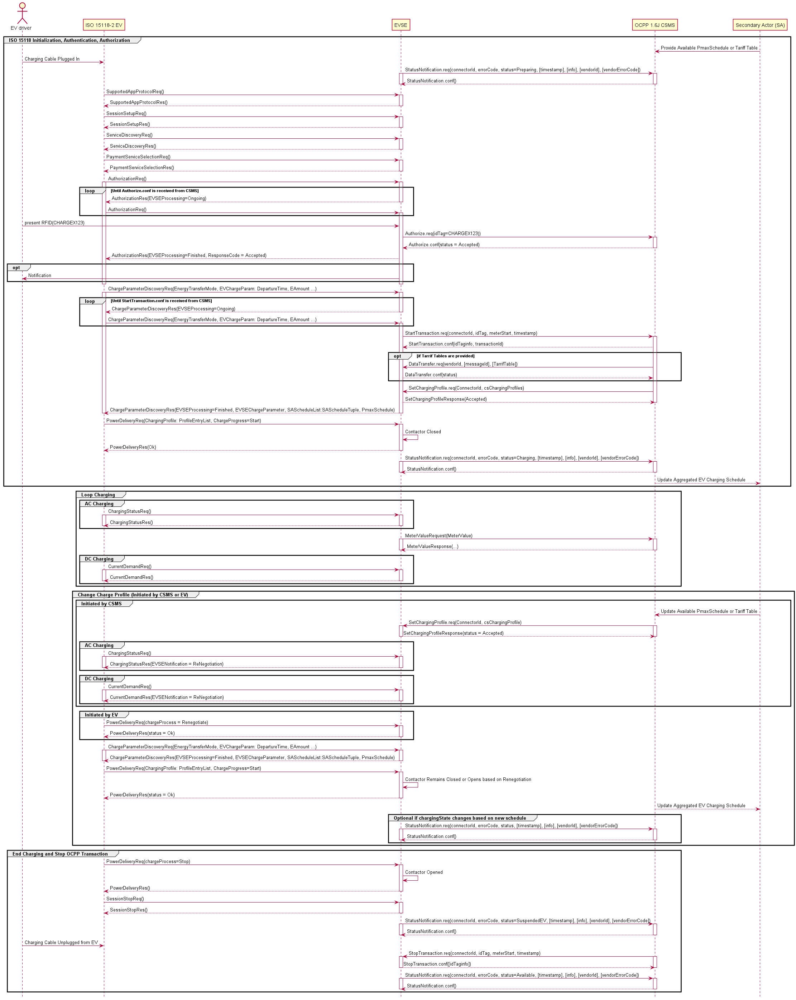

# ISO 15118-2 Controlled Charging with OCPP 1.6J Sequence Diagram

## Key Actors:
- **EV driver:** The person charging the vehicle. The driver plugs in the cable, authenticates (e.g., via RFID), and unplugs the connector when finished.
- **ISO 15118-2 EV:** EV capable of smart charge scheduling.
- **EVSE:** Interfaces with the EV (via ISO 15118-2) and the CSMS (via OCPP 1.6J).
- **CSMS:** Charge Station Management System; monitors, authorizes, and controls the charging process.
- **Secondary Actor (SA):** Supplies additional data such as tariff tables or maximum power schedules. Could be an Energy Management System (EMS) or grid operator.

---

## 1. Initialization, Authentication, and Session Setup

### Establishing the Session and Notifying the CSMS
1. The EV driver plugs in the cable, triggering the EV and EVSE to initiate communication.
2. The EVSE sends `StatusNotification.req` (status = `Preparing`) to the CSMS, which acknowledges.

### Protocol Negotiation and Service Discovery
1. The EV and EVSE exchange messages (`SupportedAppProtocolReq/Res`, `SessionSetupReq/Res`, `ServiceDiscoveryReq/Res`, `PaymentServiceSelectionReq/Res`) to agree on supported protocols and available services.

### Authorization
1. The EV sends an `AuthorizationReq` while the driver presents an RFID (e.g., `CHARGEX123`); the EVSE forwards it to the CSMS via `Authorize.req`.
2. While the CSMS verifies authorization, the EVSE replies to each `AuthorizationReq` with `AuthorizationRes` (`EVSEProcessing` = `Ongoing`).
3. After verification, the CSMS returns `Authorize.conf` (status = `Accepted`); the EVSE then replies to the next `AuthorizationReq` with `EVSEProcessing` = `Finished`.

**Insight:** RFID (ISO14443) verifies the user before any power flows. OCPP 1.6J also supports credit/debit card, mobile app, and a start button on the EVSE.

---

## 2. Controlled Charging

### EV Charging Parameter Discovery and Setting Charge Profile
1. The EV sends a `ChargeParameterDiscoveryReq` with parameters `EnergyTransferMode`, `EnergyTransferMode`, and `EVChargeParameter`, which contains the EV's max/min capabilities. Optionally, the EV may provide `DepartureTime` and `EAmount` (Energy needed by departure time). With OCPP 1.6J, this information cannot be forwarded to the CSMS.
2. The EVSE responds with a `ChargeParameterDiscoveryRes` carrying its max/min limits (`EVSEChargeParameter`) and `EVSEProcessing` = `Ongoing`, with no Secondary Actor Schedule List (`SAScheduleList`). The EVSE continues replying with `EVSEProcessing` = `Ongoing` until the CSMS accepts the OCPP transaction and provides a Charging Profile.
3. The EVSE sends `StartTransaction.req` to the CSMS; the CSMS replies with `StartTransaction.conf`.
4. The EVSE optionally sends a Tariff Table via the `DataTransfer.req/conf` message pair.
5. The CSMS provides the EVSE with a Charging Profile via the `SetChargingProfile.req/res` message pair. This profile reflects only grid constraints, not the EV driver's needs.
6. On receiving the `SetChargingProfile.req`, the EVSE replies to the next `ChargeParameterDiscoveryReq` with a `ChargeParameterDiscoveryRes` carrying `EVSEProcessing` = `Finished` and the Charging/Tariff Profile (`SAScheduleList`).

**Insight:** This is called "Controlled" Charging because the CSMS/SA does not take the driver's needs into account.

### Charge Profile Finalization
1. On receiving the `ChargeParameterDiscoveryRes` with the `SAScheduleList`, the EV determines its schedule and sends `PowerDeliveryReq` (ChargeProgress = `Start`).
2. The EV closes switch S2 in the control pilot circuit (State C) and the EVSE closes its contactors.
3. The EVSE notifies the CSMS that charging has started via `StatusNotification.req` (status = `Charging`).

**Insight:** The EV's planned Charge Profile is never sent to the CSMS or SA; only the EVSE sees it.

---

## 3. Loop Charging (Ongoing Charging Process)

### AC Charging
- EV periodically sends `ChargingStatusReq`; EVSE replies with `ChargingStatusRes` (includes `EVSEMaxCurrent`, status).
- EVSE reports energy and meter values to CSMS via `MeterValueRequest`/`MeterValueResponse`.

**Insight:** The `ChargingStatusReq` does not include SOC or other EV-side telemetry. Its frequency depends on the EV OEM, which can limit how quickly an EV responds to a new max current limit or a renegotiation request.

### DC Charging
- The EV sends `CurrentDemandReq` every 250 ms to maintain real-time communication with the EVSE. The message supplies EV status, SOC, target current and voltage, maximum limits, and present current and voltage.
- The EVSE responds with `CurrentDemandRes` (present voltage/current, limits, status).

**Insight:** The DC loop drives precise current control. The EVSE delivers the current the EV requests, within limits.

---

## 4. Change Charge Profile

### Triggering a Charge Profile Change
- **By CSMS:** Sends `SetChargingProfile.req` to the EVSE (e.g., due to updated tariffs or power constraints) with a new `csChargingProfile`. The EVSE replies in `ChargingStatusRes` with `EVSENotification` = `ReNegotiation`, prompting the EV to send an updated `ChargeParameterDiscoveryReq`.
- **By EV:** Sends `PowerDeliveryReq` (`chargeProcess = Renegotiate`) when the departure time or the driver's energy needs change.

### Implementing the Charge Profile Change
1. EV re-initiates discovery (`ChargeParameterDiscoveryReq/Res`).
2. The EVSE sends an updated `SAScheduleList` via `ChargeParameterDiscoveryRes`, or the same one if the change wasn't triggered by the CSMS.
3. EV adjusts its schedule and sends a new `PowerDeliveryReq` (ChargeProgress = `Start`); it may pause or stop.

**Insight:** Mid-session profile updates let the system adapt to grid conditions or pricing without ending the transaction.

---

## 5. End Charging and Transaction Termination
1. The EV initiates termination by sending `PowerDeliveryReq` (chargeProcess = `Stop`); the EVSE opens contactors.
2. The EV sends `SessionStopReq` to end the communication session; the EVSE confirms with `SessionStopRes`.
3. The EVSE updates the CSMS of the new status via `StatusNotification.req` (status = `SuspendedEV`).
4. The EVSE ends the OCPP transaction via `StopTransaction.req`.
5. After the driver unplugs, the EVSE sends `StatusNotification.req` (status = `Available`).

**Insight:** The station returns to `Available` only after the cable is removed.

---

## References
- [ISO 15118-2](https://www.iso.org/standard/55366.html)
- [OCPP 1.6J](https://openchargealliance.org/protocols/open-charge-point-protocol/#OCPP1.6)
- PlantUML source: `iso15118_2_ac-ocpp16.puml`