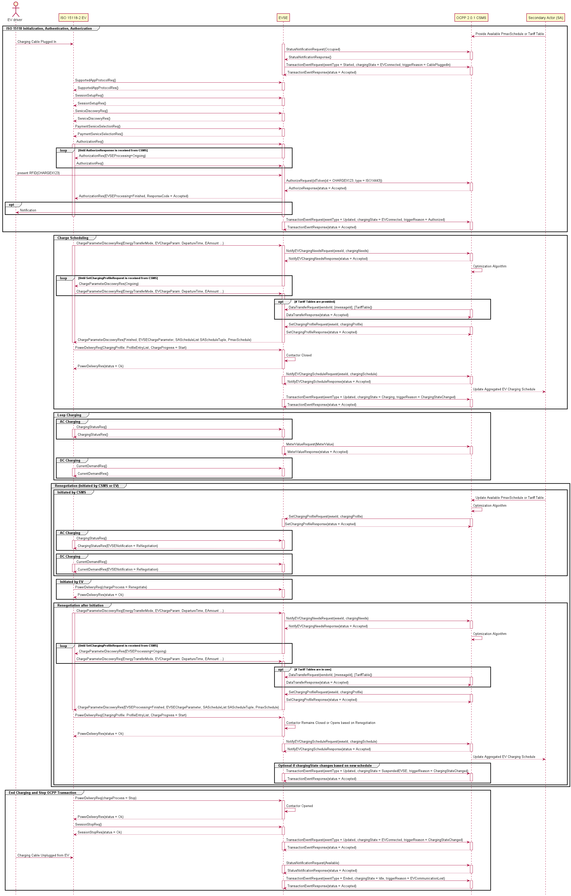

# ISO 15118-2 HLC Optimized Charge Scheduling with OCPP 2.0.1 Sequence Diagram

## Key Actors:
- **EV driver:** The person charging the vehicle. The driver plugs in the cable, authenticates (e.g., via RFID), and unplugs the connector when finished.
- **ISO 15118-2 EV:** EV capable of smart charge scheduling.
- **EVSE:** Interfaces with the EV (via ISO 15118-2) and the CSMS (via OCPP 2.0.1).
- **CSMS:** Charge Station Management System; monitors, authorizes, and optimizes the charging process.
- **Secondary Actor (SA):** Supplies additional data such as tariff tables or maximum power schedules. Could be an Energy Management System (EMS) or grid operator.

---

## 1. Initialization, Authentication, and Session Setup

### Establishing the Session and Notifying the CSMS
1. The EV driver plugs in the cable, triggering the EV and EVSE to initiate communication.
2. The EVSE sends a `StatusNotificationRequest` (state: "Occupied") and a `TransactionEventRequest` (eventType = `Started`, chargingState = `EVConnected`, triggerReason = `CablePluggedIn`) to the CSMS, which acknowledges.

### Protocol Negotiation and Service Discovery
1. The EV and EVSE exchange messages (`SupportedAppProtocolReq/Res`, `SessionSetupReq/Res`, `ServiceDiscoveryReq/Res`, `PaymentServiceSelectionReq/Res`) to agree on supported protocols and available services.

### Authorization
1. The EV sends an `AuthorizationReq` while the driver presents an RFID (e.g., `CHARGEX123`); the EVSE forwards it to the CSMS via `AuthorizeRequest`.
2. While the CSMS verifies authorization, the EVSE replies to each `AuthorizationReq` with `AuthorizationRes` (`EVSEProcessing` = `Ongoing`).
3. After verification, an `AuthorizeResponse` and subsequent `AuthorizationRes` (ResponseCode = `Accepted`) authorize the session.

**Insight:** RFID (ISO14443) verifies the user before any power flows. OCPP 2.0.1 also supports contract certificates (PnC), credit/debit card, mobile app (CSMS-initiated), start button, and PIN code.

---

## 2. Optimized Charge Scheduling

### EV Charging Parameter Discovery
1. The EV sends a `ChargeParameterDiscoveryReq` containing key parameters such as `EnergyTransferMode`, `DepartureTime`, `EAmount` (Energy needed by departure time), and `EVChargeParam`, which contains the EV's max/min capabilities.
2. The EVSE forwards these charging needs to the CSMS via `NotifyEVChargingNeedsRequest`; the CSMS responds.

**Insight:** `EAmount` and `DepartureTime` let the CSMS generate an optimized charging schedule.

### Charge Profile Optimization and Finalization
1. The CSMS runs an internal optimization algorithm (possibly incorporating tariff tables and PmaxSchedules from the SA) to determine the available power schedule for the EV.
2. If tariff tables are also used, a separate `DataTransferRequest` is sent to the EVSE.
3. The CSMS sends `SetChargingProfileRequest` with the available power profile; the EVSE includes this in `ChargeParameterDiscoveryRes` to the EV.
4. The EV uses the profile to determine its optimal charging schedule and sends `PowerDeliveryReq` (detailed profile, ChargeProgress = `Start`).
5. The EVSE notifies the CSMS of the EV's charging schedule via `NotifyEVChargingScheduleRequest`; schedules may also go to the SA.

**Insight:** The charging schedule (typically a list of profile entries) tells the CSMS and SA how much power the EV plans to draw in each time slot.

---

## 3. Loop Charging (Ongoing Charging Process)

### AC Charging
- The EV periodically sends `ChargingStatusReq`; the EVSE replies with `ChargingStatusRes` (includes `EVSEMaxCurrent`, status).
- The EVSE reports energy and meter values to the CSMS via `MeterValueRequest`/`MeterValueResponse`.

**Insight:** The `ChargingStatusReq` does not include SOC or other EV-side telemetry. Its frequency depends on the EV OEM, which can limit how quickly an EV responds to a new max current limit or a renegotiation request.

### DC Charging
- The EV sends `CurrentDemandReq` every 250 ms to maintain real-time communication with the EVSE. The message supplies EV status, SOC, target current and voltage, maximum limits, and present current and voltage.
- The EVSE responds with `CurrentDemandRes` (present voltage/current, limits, status).

**Insight:** The DC loop drives precise current control. The EVSE delivers the current the EV requests, within limits.

---

## 4. Renegotiation of Charge Schedule

### Triggering a Renegotiation
- **By CSMS:** Sends `SetChargingProfileRequest` to the EVSE (e.g., due to updated tariffs or power constraints) with a new `ChargingProfile`. The EVSE replies in `ChargingStatusRes` with `EVSENotification` = `ReNegotiation`, prompting the EV to send an updated `ChargeParameterDiscoveryReq` with new `DepartureTime` and `EAmount` values.
- **By EV:** Sends `PowerDeliveryReq` (`chargeProcess = Renegotiate`) with updated `DepartureTime` and `EAmount` when the departure time or the driver's energy needs change.

### Implementing the Renegotiation
1. The EV re-initiates discovery (`ChargeParameterDiscoveryReq/Res`).
2. The EVSE sends an updated `SetChargingProfileRequest` to the EV via `ChargeParameterDiscoveryRes`.
3. The EV adjusts its schedule and sends a new `PowerDeliveryReq` (ChargeProgress = `Start`); it may pause or stop if needed.
4. The EVSE notifies the CSMS via `NotifyEVChargingScheduleRequest`; schedules may be sent to the SA.

**Insight:** Mid-session renegotiation lets the system adapt to grid conditions, pricing, or EV requirements without ending the transaction.

---

## 5. End Charging and Transaction Termination
1. The EV initiates termination by sending `PowerDeliveryReq` (chargeProcess = `Stop`); the EVSE opens contactors.
2. The EV sends `SessionStopReq` to end the communication session; the EVSE confirms with `SessionStopRes`.
3. The EVSE updates the CSMS: first a `TransactionEventRequest` (EV still connected), then a final `TransactionEventRequest` (eventType = `Ended`, chargingState = `Idle`).
4. After the driver unplugs, the EVSE sends `StatusNotificationRequest` (state: `Available`).

**Insight:** The station returns to `Available` only after the cable is removed.

## References
- [ISO 15118-2](https://www.iso.org/standard/55366.html)
- [OCPP 2.0.1 (IEC 63584)](https://openchargealliance.org/protocols/open-charge-point-protocol/#OCPP2.0.1)
- PlantUML source: `iso15118_2_ac-ocpp2.puml`