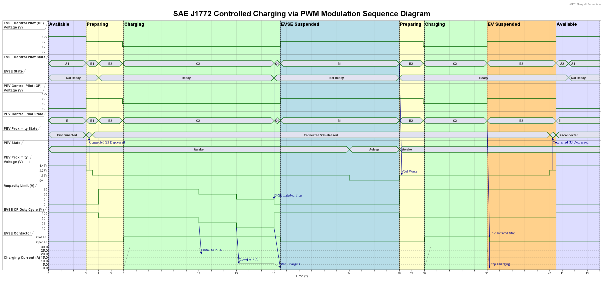

# SAE J1772 PWM Sequence Diagram

## Timeline

- **Time t = 0**  
  - EVSE is powered on but not plugged into PEV; control pilot in **State A1** (12 V).  
  - PEV is awake; proximity voltage 4.46 V (Disconnected); control pilot in **State E** (0 V).

- **Time t = 3**  
  - EVSE is plugged into PEV with S3 depressed on the connector (2.77 V).  
  - Control pilot transitions to **State B1** (9 V).

- **Time t = 3.5**  
  - Driver releases S3; PEV proximity voltage drops to 1.53 V (Connected, S3 release).  
  - Connector is fully engaged with the PEV inlet.

- **Time t = 4**  
  - EVSE turns on the control pilot oscillator → **State B2** at 50 % duty cycle (30 A).  
  - EVSE waits for PEV to move to **State C2** before closing contactors.

- **Time t = 5.9**  
  - PEV sets control pilot to **State C2** (6 V), signaling ready to charge and requesting contactor closure.

- **Time t = 6**  
  - EVSE closes AC contactors, supplying AC power.  
  - PEV onboard charger ramps up current.

- **Time t = 6.5**  
  - PEV charging current reaches the 30 A ampacity limit (50 % duty cycle).

- **Time t = 12**  
  - EVSE reduces duty cycle to 33.33 % (20 A limit).  
  - PEV curtails current.

- **Time t = 12.2**  
  - PEV settles at 20 A.

- **Time t = 15**  
  - EVSE reduces duty cycle to 10 % (6 A limit).  
  - PEV curtails further.

- **Time t = 15.2**  
  - PEV settles at 6 A.

- **Time t = 18**  
  - EVSE turns off the oscillator → **State C1**, initiating end-of-charge.  
  - PEV ramps current down.

- **Time t = 18.5**  
  - EVSE opens contactors, stopping charging.  
  - PEV control pilot reverts to **State B1** (9 V).

- **Time t = 24**  
  - To conserve energy, PEV falls asleep.

- **Time t = 28**  
  - EVSE wakes PEV by starting the oscillator → **State B2** (50 % duty cycle).

- **Time t = 29.9**  
  - PEV returns control pilot to **State C2** (6 V), requesting contactor closure.

- **Time t = 30**  
  - EVSE closes contactors again; PEV ramps up current.

- **Time t = 30.5**  
  - PEV current hits 30 A limit (50 % duty cycle).

- **Time t = 35**  
  - PEV moves pilot from **State C2** to **B2** (9 V), initiating end of session.

- **Time t = 35.2**  
  - EVSE opens contactors; control pilot remains in **State B2**, ready for a new session.

- **Time t = 40**  
  - Driver presses the S3 button on the connector.

- **Time t = 40.5**  
  - Driver removes connector; EVSE pilot oscillates in **State A2**, PEV pilot in **State E**.  
  - PEV proximity voltage returns to 4.46 V (Disconnected).

- **Time t = 41.5**  
  - EVSE turns off oscillator → **State A1**.

## References
- [SAE J1772](https://doi.org/10.4271/J1772_202401)
- PlantUML source: `pwm-charging.puml`