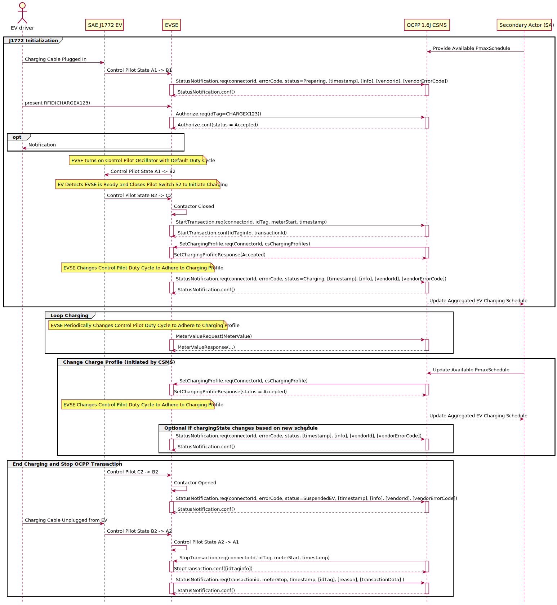

# SAE J1772 PWM Controlled Charging with OCPP 1.6J Sequence Diagram

## Key Actors:
- **EV driver:** The person charging the vehicle. The driver plugs in the cable, authenticates (e.g., via RFID), and unplugs the connector when finished.
- **SAE J1772 EV:** Electric vehicle using analog control pilot signaling to charge via AC voltage.
- **Charging Station (CS):** EVSE implementing both the analog control pilot (PWM) and the OCPP 1.6J client.
- **OCPP 1.6J CSMS:** Back-end Charge Station Management System orchestrating sessions via OCPP 1.6J.

---

## Sequence Overview
## 1. Initialization, Authentication, and Session Setup

### Establishing the Session and Notifying the CSMS
1. The EV driver plugs in the cable, changing the pilot state from A1→B1.
2. The EVSE sends `StatusNotification.req` (status = `Preparing`) to the CSMS, which acknowledges.

### Authorization
1. The driver presents an RFID (e.g., `CHARGEX123`); the EVSE forwards it to the CSMS via `Authorize.req`.
2. The CSMS replies with `Authorize.conf` (status = `Accepted`). The EVSE turns on the control pilot oscillator (State B1→B2) at the default duty cycle.

**Insight:** RFID (ISO14443) verifies the user before any power flows. OCPP 1.6J also supports credit/debit card, mobile app, and a start button on the EVSE.

### Session Start
1. The EV detects the EVSE is ready and closes control pilot switch S2 (State B2→C2) to initiate charging.
2. The EVSE detects State C2 and closes its AC contactors, applying power to the EV's onboard charger.
3. The EVSE sends `StartTransaction.req` to the CSMS; the CSMS replies with `StartTransaction.conf`.
4. Optionally, the CSMS sends a Charging Profile (`SetChargingProfile.req`); the EVSE confirms with `SetChargingProfile.conf` and updates the control pilot duty cycle to match.
5. The EVSE sends `StatusNotification.req` (status = `Charging`).

**Insight:** Charging Profiles encode grid constraints, not driver needs. The EV obeys the duty-cycle limit and cannot negotiate its own energy or departure requirements through J1772.

## 2. Loop Charging (Ongoing Charging Process)

### AC Charging
1. The EVSE holds the control pilot duty cycle at the value dictated by the active Charging Profile. The duty cycle is a max amperage limit, not a setpoint; the EV draws up to but not above this limit.
2. The EVSE sends periodic meter readings to the CSMS via `MeterValues.req`/`MeterValues.conf`.

### Change Charge Profile (Initiated by CSMS)
1. The CSMS sends `SetChargingProfile.req` with an updated `csChargingProfile`. The EVSE replies with `SetChargingProfile.conf`.
2. The EVSE adjusts the control pilot duty cycle to match the new profile.

**Insight:** Mid-session profile updates let the operator respond to grid conditions without ending the transaction.

## 3. End Charging and Transaction Termination
1. The EV ends the charge by opening control pilot switch S2 (State C2→B2).
2. The EVSE detects the state change and opens its AC contactors.
3. The EVSE sends `StatusNotification.req` (status = `SuspendedEV`).
4. The driver unplugs the cable from the EV (State B2→A2).
5. The EVSE shuts off the control pilot oscillator (State A2→A1).
6. The EVSE ends the OCPP transaction with `StopTransaction.req`.
7. The EVSE sends `StatusNotification.req` (status = `Available`).

**Insight:** Physical disconnect (S2 open → contactors open → cable unplug) precedes the OCPP `StopTransaction`. The station returns to `Available` only after the cable is removed.

---

## References
- [SAE J1772](https://doi.org/10.4271/J1772_202401)
- [OCPP 1.6J](https://openchargealliance.org/protocols/open-charge-point-protocol/#OCPP1.6)
- PlantUML source: `pwm-ocpp16.puml`