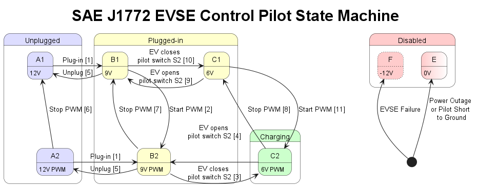

# SAE J1772 EVSE Control Pilot State Machine

A finite-state machine outlining the key control-pilot transitions for the EVSE under the SAE J1772 standard. Each numbered item represents a state change triggered by driver, EV, or EVSE actions.

## State Transitions

1. **Driver plugs EVSE into PEV**  
2. **EVSE detects plug-in and is ready to start charging**  
3. **EV detects EVSE is ready and closes S2 to initiate charging**  
4. **EV-initiated stop**  
5. **Driver unplugs EVSE from PEV**  
6. **EVSE unplugged from PEV and pilot is still oscillating**  
7. **EVSE not ready**  
8. **EVSE-initiated stop**  
9. **EV responds to EVSE-initiated stop or EV-initiated BCB toggle**  
10. **Occurs only during BCB toggle (rare)**  
11. **EVSE ready quickly after EVSE-initiated stop (rare)**

> _A change from any state to state Aₓ, E, or F may occur at any time._

## References
- [SAE J1772](https://doi.org/10.4271/J1772_202401)
- PlantUML source: `evse-control-pilot.puml`